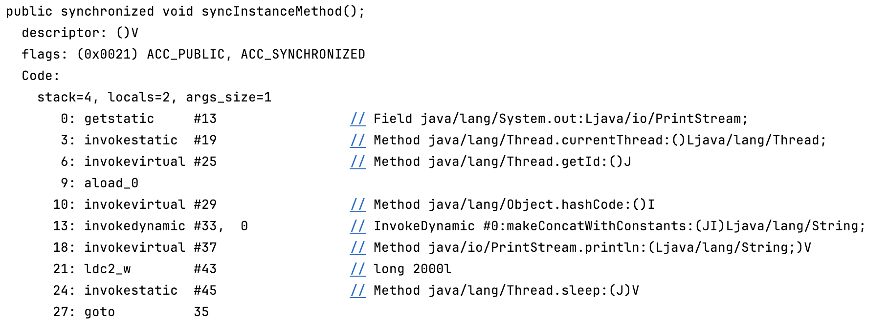
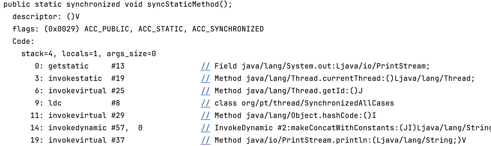

### 什么是锁？

锁（Lock）是用于控制多线程对共享资源访问的一种同步机制，目的是确保线程安全，防止多个线程同时修改共享资源导致数据不一致或竞争条件（race condition）

### 实现方式

- **内置锁（synchronized）**：通过 synchronized 关键字实现，基于 JVM 的监视器（Monitor）机制。
- **显式锁（Lock 接口）**：java.util.concurrent.locks 包中的锁，如 ReentrantLock、ReadWriteLock 和 StampedLock
- **其他机制**：如 volatile 关键字（提供可见性但非互斥锁）或基于 CAS（Compare-And-Swap）的原子操作

### 内置锁（synchronized）的使用形式

| 使用形式         | 锁定的对象 (Lock Object)              | 作用范围                           |
| :--------------- | :------------------------------------ | :--------------------------------- |
| **修饰实例方法** | 当前实例对象 (`this`)                 | 对同一个实例的调用互斥             |
| **修饰静态方法** | 类的 `Class` 对象 (`ClassName.class`) | 对类的所有实例的调用都互斥         |
| **修饰代码块**   | 括号内指定的任意对象                  | 灵活，对锁定同一个对象的代码块互斥 |

### 内置锁（synchronized）的实现原理

`synchronized`是Java中最基础的同步工具。它的实现依赖于每个Java对象都关联一个的**Monitor（监视器锁）**。当一个线程试图进入一个`synchronized`保护的代码块时，它必须先获取该代码块所指定的对象的Monitor，`synchronized`的实现细节在JVM层面，通过特定的**字节码指令**来完成。

#### 实现原理：Monitor与字节码

- **Monitor**: 可以理解为一个计数器。当一个线程获取锁（Monitor）时，计数器加1。当该线程再次获取同一个锁时（即可重入性），计数器会继续累加。当线程退出同步块时，计数器减1。当计数器归零时，锁被完全释放，其他等待的线程可以竞争该锁。

- 字节码指令`monitorenter`: 在同步代码块开始的位置，JVM会插入`monitorenter`指令。线程执行到这里时，会尝试获取对象所对应的Monitor的所有权。`monitorexit`: 在同步代码块结束和异常退出的位置，JVM会插入`monitorexit`指令。这个指令会将Monitor的计数器减1，当计数器为0时，锁就被释放

#### 具体代码案例分析

```java
package org.pt.thread;

/**
 * @ClassName SynchronizedAllCases
 * @Author pt
 * @Description
 * @Date 2025/6/18 20:51
 **/
/**
 * 该类全面演示了synchronized关键字的所有使用情况。
 */
public class SynchronizedAllCases {

    private final Object instanceLock = new Object();

    // 锁对象：当前类的实例对象 (this)
    public synchronized void syncInstanceMethod() {
        System.out.println("Thread-" + Thread.currentThread().getId() + " 进入 syncInstanceMethod，锁是 [this] instance: " + this.hashCode());
        try {
            // 模拟业务耗时
            Thread.sleep(2000);
        } catch (InterruptedException e) {
            e.printStackTrace();
        }
        System.out.println("Thread-" + Thread.currentThread().getId() + " 离开 syncInstanceMethod");
    }

    // 锁对象：当前类的Class对象 (SynchronizedAllCases.class)
    public static synchronized void syncStaticMethod() {
        System.out.println("Thread-" + Thread.currentThread().getId() + " 进入 syncStaticMethod，锁是 [Class] object: " + SynchronizedAllCases.class.hashCode());
        try {
            Thread.sleep(2000);
        } catch (InterruptedException e) {
            e.printStackTrace();
        }
        System.out.println("Thread-" + Thread.currentThread().getId() + " 离开 syncStaticMethod");
    }

    /**
     *
     * 锁对象：当前类的实例对象 (this)，效果等同于 Case 1
     */
    public void syncBlockOnThis() {
        synchronized (this) {
            System.out.println("Thread-" + Thread.currentThread().getId() + " 进入 syncBlockOnThis，锁是 [this] instance: " + this.hashCode());
            try {
                Thread.sleep(2000);
            } catch (InterruptedException e) {
                e.printStackTrace();
            }
            System.out.println("Thread-" + Thread.currentThread().getId() + " 离开 syncBlockOnThis");
        }
    }

    /**
     *
     * 锁对象：成员变量 instanceLock
     */
    public void syncBlockOnObject() {
        synchronized (instanceLock) {
            System.out.println("Thread-" + Thread.currentThread().getId() + " 进入 syncBlockOnObject，锁是 [instanceLock] object: " + instanceLock.hashCode());
            try {
                Thread.sleep(2000);
            } catch (InterruptedException e) {
                e.printStackTrace();
            }
            System.out.println("Thread-" + Thread.currentThread().getId() + " 离开 syncBlockOnObject");
        }
    }

    /**
     *
     * 锁对象：当前类的Class对象 (SynchronizedAllCases.class)，效果等同于 Case 2
     */
    public void syncBlockOnClass() {
        synchronized (SynchronizedAllCases.class) {
            System.out.println("Thread-" + Thread.currentThread().getId() + " 进入 syncBlockOnClass，锁是 [Class] object: " + SynchronizedAllCases.class.hashCode());
            try {
                Thread.sleep(2000);
            } catch (InterruptedException e) {
                e.printStackTrace();
            }
            System.out.println("Thread-" + Thread.currentThread().getId() + " 离开 syncBlockOnClass");
        }
    }


    public static void main(String[] args) throws InterruptedException {
        SynchronizedAllCases demo1 = new SynchronizedAllCases();
        SynchronizedAllCases demo2 = new SynchronizedAllCases();

        System.out.println("======== 演示实例锁（同一个实例）========");
        // 两个线程竞争同一个实例(demo1)的锁，会互斥
        new Thread(demo1::syncInstanceMethod, "T1-A").start();
        new Thread(demo1::syncBlockOnThis, "T1-B").start();
        Thread.sleep(5000); // 等待上面执行完

        System.out.println("\n======== 演示实例锁（不同实例）========");
        // 两个线程分别作用于不同实例(demo1, demo2)，锁对象不同，不会互斥
        new Thread(demo1::syncInstanceMethod, "T2-A").start();
        new Thread(demo2::syncInstanceMethod, "T2-B").start();
        Thread.sleep(5000);

        System.out.println("\n======== 演示类锁（Class锁）========");
        // 两个线程竞争同一个Class锁，即使作用于不同实例，依然会互斥
        new Thread(demo1::syncBlockOnClass, "T3-A").start();
        new Thread(SynchronizedAllCases::syncStaticMethod, "T3-B").start();
        Thread.sleep(5000);

        System.out.println("\n======== 演示实例锁和类锁互不影响 ========");
        // 一个线程获取实例锁(demo1)，一个线程获取类锁，锁对象不同，不会互斥
        new Thread(demo1::syncInstanceMethod, "T4-A").start();
        new Thread(SynchronizedAllCases::syncStaticMethod, "T4-B").start();
        Thread.sleep(5000);

        System.out.println("\n======== 演示不同实例成员锁互不影响 ========");
        // 两个线程在同一个实例上，但锁的是不同的成员对象，不会互斥
        new Thread(demo1::syncBlockOnThis, "T5-A").start();
        new Thread(demo1::syncBlockOnObject, "T5-B").start();
    }
}

```

#### 执行结果

```
======== 演示实例锁（同一个实例）========
Thread-15 进入 syncInstanceMethod，锁是 [this] instance: 837019185
Thread-15 离开 syncInstanceMethod
Thread-16 进入 syncBlockOnThis，锁是 [this] instance: 837019185
Thread-16 离开 syncBlockOnThis

======== 演示实例锁（不同实例）========
Thread-17 进入 syncInstanceMethod，锁是 [this] instance: 837019185
Thread-18 进入 syncInstanceMethod，锁是 [this] instance: 1275581963
Thread-18 离开 syncInstanceMethod
Thread-17 离开 syncInstanceMethod

======== 演示类锁（Class锁）========
Thread-19 进入 syncBlockOnClass，锁是 [Class] object: 1706377736
Thread-19 离开 syncBlockOnClass
Thread-20 进入 syncStaticMethod，锁是 [Class] object: 1706377736
Thread-20 离开 syncStaticMethod

======== 演示实例锁和类锁互不影响 ========
Thread-21 进入 syncInstanceMethod，锁是 [this] instance: 837019185
Thread-22 进入 syncStaticMethod，锁是 [Class] object: 1706377736
Thread-21 离开 syncInstanceMethod
Thread-22 离开 syncStaticMethod

======== 演示不同实例成员锁互不影响 ========
Thread-23 进入 syncBlockOnThis，锁是 [this] instance: 837019185
Thread-24 进入 syncBlockOnObject，锁是 [instanceLock] object: 425224686
Thread-23 离开 syncBlockOnThis
Thread-24 离开 syncBlockOnObject
```

###   底层实现-字节码

先将java文件编译为class文件，class文件编译为字节码

```shell
javac SynchronizedAllCases.java
```

```
 javap -v SynchronizedAllCases 
```

###   字节码查看

```java
警告: 文件 ./SynchronizedAllCases.class 不包含类 SynchronizedAllCases
Compiled from "SynchronizedAllCases.java"
public class org.pt.thread.SynchronizedAllCases {
  public org.pt.thread.SynchronizedAllCases();
    Code:
       0: aload_0
       1: invokespecial #1                  // Method java/lang/Object."<init>":()V
       4: aload_0
       5: new           #2                  // class java/lang/Object
       8: dup
       9: invokespecial #1                  // Method java/lang/Object."<init>":()V
      12: putfield      #7                  // Field instanceLock:Ljava/lang/Object;
      15: return

  public synchronized void syncInstanceMethod();
    Code:
       0: getstatic     #13                 // Field java/lang/System.out:Ljava/io/PrintStream;
       3: invokestatic  #19                 // Method java/lang/Thread.currentThread:()Ljava/lang/Thread;
       6: invokevirtual #25                 // Method java/lang/Thread.getId:()J
       9: aload_0
      10: invokevirtual #29                 // Method java/lang/Object.hashCode:()I
      13: invokedynamic #33,  0             // InvokeDynamic #0:makeConcatWithConstants:(JI)Ljava/lang/String;
      18: invokevirtual #37                 // Method java/io/PrintStream.println:(Ljava/lang/String;)V
      21: ldc2_w        #43                 // long 2000l
      24: invokestatic  #45                 // Method java/lang/Thread.sleep:(J)V
      27: goto          35
      30: astore_1
      31: aload_1
      32: invokevirtual #51                 // Method java/lang/InterruptedException.printStackTrace:()V
      35: getstatic     #13                 // Field java/lang/System.out:Ljava/io/PrintStream;
      38: invokestatic  #19                 // Method java/lang/Thread.currentThread:()Ljava/lang/Thread;
      41: invokevirtual #25                 // Method java/lang/Thread.getId:()J
      44: invokedynamic #54,  0             // InvokeDynamic #1:makeConcatWithConstants:(J)Ljava/lang/String;
      49: invokevirtual #37                 // Method java/io/PrintStream.println:(Ljava/lang/String;)V
      52: return
    Exception table:
       from    to  target type
          21    27    30   Class java/lang/InterruptedException

  public static synchronized void syncStaticMethod();
    Code:
       0: getstatic     #13                 // Field java/lang/System.out:Ljava/io/PrintStream;
       3: invokestatic  #19                 // Method java/lang/Thread.currentThread:()Ljava/lang/Thread;
       6: invokevirtual #25                 // Method java/lang/Thread.getId:()J
       9: ldc           #8                  // class org/pt/thread/SynchronizedAllCases
      11: invokevirtual #29                 // Method java/lang/Object.hashCode:()I
      14: invokedynamic #57,  0             // InvokeDynamic #2:makeConcatWithConstants:(JI)Ljava/lang/String;
      19: invokevirtual #37                 // Method java/io/PrintStream.println:(Ljava/lang/String;)V
      22: ldc2_w        #43                 // long 2000l
      25: invokestatic  #45                 // Method java/lang/Thread.sleep:(J)V
      28: goto          36
      31: astore_0
      32: aload_0
      33: invokevirtual #51                 // Method java/lang/InterruptedException.printStackTrace:()V
      36: getstatic     #13                 // Field java/lang/System.out:Ljava/io/PrintStream;
      39: invokestatic  #19                 // Method java/lang/Thread.currentThread:()Ljava/lang/Thread;
      42: invokevirtual #25                 // Method java/lang/Thread.getId:()J
      45: invokedynamic #58,  0             // InvokeDynamic #3:makeConcatWithConstants:(J)Ljava/lang/String;
      50: invokevirtual #37                 // Method java/io/PrintStream.println:(Ljava/lang/String;)V
      53: return
    Exception table:
       from    to  target type
          22    28    31   Class java/lang/InterruptedException

  public void syncBlockOnThis();
    Code:
       0: aload_0
       1: dup
       2: astore_1
       3: monitorenter
       4: getstatic     #13                 // Field java/lang/System.out:Ljava/io/PrintStream;
       7: invokestatic  #19                 // Method java/lang/Thread.currentThread:()Ljava/lang/Thread;
      10: invokevirtual #25                 // Method java/lang/Thread.getId:()J
      13: aload_0
      14: invokevirtual #29                 // Method java/lang/Object.hashCode:()I
      17: invokedynamic #59,  0             // InvokeDynamic #4:makeConcatWithConstants:(JI)Ljava/lang/String;
      22: invokevirtual #37                 // Method java/io/PrintStream.println:(Ljava/lang/String;)V
      25: ldc2_w        #43                 // long 2000l
      28: invokestatic  #45                 // Method java/lang/Thread.sleep:(J)V
      31: goto          39
      34: astore_2
      35: aload_2
      36: invokevirtual #51                 // Method java/lang/InterruptedException.printStackTrace:()V
      39: getstatic     #13                 // Field java/lang/System.out:Ljava/io/PrintStream;
      42: invokestatic  #19                 // Method java/lang/Thread.currentThread:()Ljava/lang/Thread;
      45: invokevirtual #25                 // Method java/lang/Thread.getId:()J
      48: invokedynamic #60,  0             // InvokeDynamic #5:makeConcatWithConstants:(J)Ljava/lang/String;
      53: invokevirtual #37                 // Method java/io/PrintStream.println:(Ljava/lang/String;)V
      56: aload_1
      57: monitorexit
      58: goto          66
      61: astore_3
      62: aload_1
      63: monitorexit
      64: aload_3
      65: athrow
      66: return
    Exception table:
       from    to  target type
          25    31    34   Class java/lang/InterruptedException
           4    58    61   any
          61    64    61   any

  public void syncBlockOnObject();
    Code:
       0: aload_0
       1: getfield      #7                  // Field instanceLock:Ljava/lang/Object;
       4: dup
       5: astore_1
       6: monitorenter
       7: getstatic     #13                 // Field java/lang/System.out:Ljava/io/PrintStream;
      10: invokestatic  #19                 // Method java/lang/Thread.currentThread:()Ljava/lang/Thread;
      13: invokevirtual #25                 // Method java/lang/Thread.getId:()J
      16: aload_0
      17: getfield      #7                  // Field instanceLock:Ljava/lang/Object;
      20: invokevirtual #29                 // Method java/lang/Object.hashCode:()I
      23: invokedynamic #61,  0             // InvokeDynamic #6:makeConcatWithConstants:(JI)Ljava/lang/String;
      28: invokevirtual #37                 // Method java/io/PrintStream.println:(Ljava/lang/String;)V
      31: ldc2_w        #43                 // long 2000l
      34: invokestatic  #45                 // Method java/lang/Thread.sleep:(J)V
      37: goto          45
      40: astore_2
      41: aload_2
      42: invokevirtual #51                 // Method java/lang/InterruptedException.printStackTrace:()V
      45: getstatic     #13                 // Field java/lang/System.out:Ljava/io/PrintStream;
      48: invokestatic  #19                 // Method java/lang/Thread.currentThread:()Ljava/lang/Thread;
      51: invokevirtual #25                 // Method java/lang/Thread.getId:()J
      54: invokedynamic #62,  0             // InvokeDynamic #7:makeConcatWithConstants:(J)Ljava/lang/String;
      59: invokevirtual #37                 // Method java/io/PrintStream.println:(Ljava/lang/String;)V
      62: aload_1
      63: monitorexit
      64: goto          72
      67: astore_3
      68: aload_1
      69: monitorexit
      70: aload_3
      71: athrow
      72: return
    Exception table:
       from    to  target type
          31    37    40   Class java/lang/InterruptedException
           7    64    67   any
          67    70    67   any

  public void syncBlockOnClass();
    Code:
       0: ldc           #8                  // class org/pt/thread/SynchronizedAllCases
       2: dup
       3: astore_1
       4: monitorenter
       5: getstatic     #13                 // Field java/lang/System.out:Ljava/io/PrintStream;
       8: invokestatic  #19                 // Method java/lang/Thread.currentThread:()Ljava/lang/Thread;
      11: invokevirtual #25                 // Method java/lang/Thread.getId:()J
      14: ldc           #8                  // class org/pt/thread/SynchronizedAllCases
      16: invokevirtual #29                 // Method java/lang/Object.hashCode:()I
      19: invokedynamic #63,  0             // InvokeDynamic #8:makeConcatWithConstants:(JI)Ljava/lang/String;
      24: invokevirtual #37                 // Method java/io/PrintStream.println:(Ljava/lang/String;)V
      27: ldc2_w        #43                 // long 2000l
      30: invokestatic  #45                 // Method java/lang/Thread.sleep:(J)V
      33: goto          41
      36: astore_2
      37: aload_2
      38: invokevirtual #51                 // Method java/lang/InterruptedException.printStackTrace:()V
      41: getstatic     #13                 // Field java/lang/System.out:Ljava/io/PrintStream;
      44: invokestatic  #19                 // Method java/lang/Thread.currentThread:()Ljava/lang/Thread;
      47: invokevirtual #25                 // Method java/lang/Thread.getId:()J
      50: invokedynamic #64,  0             // InvokeDynamic #9:makeConcatWithConstants:(J)Ljava/lang/String;
      55: invokevirtual #37                 // Method java/io/PrintStream.println:(Ljava/lang/String;)V
      58: aload_1
      59: monitorexit
      60: goto          68
      63: astore_3
      64: aload_1
      65: monitorexit
      66: aload_3
      67: athrow
      68: return
    Exception table:
       from    to  target type
          27    33    36   Class java/lang/InterruptedException
           5    60    63   any
          63    66    63   any

  public static void main(java.lang.String[]) throws java.lang.InterruptedException;
    Code:
       0: new           #8                  // class org/pt/thread/SynchronizedAllCases
       3: dup
       4: invokespecial #65                 // Method "<init>":()V
       7: astore_1
       8: new           #8                  // class org/pt/thread/SynchronizedAllCases
      11: dup
      12: invokespecial #65                 // Method "<init>":()V
      15: astore_2
      16: getstatic     #13                 // Field java/lang/System.out:Ljava/io/PrintStream;
      19: ldc           #66                 // String ======== 演示实例锁（同一个实例）========
      21: invokevirtual #37                 // Method java/io/PrintStream.println:(Ljava/lang/String;)V
      24: new           #20                 // class java/lang/Thread
      27: dup
      28: aload_1
      29: dup
      30: invokestatic  #68                 // Method java/util/Objects.requireNonNull:(Ljava/lang/Object;)Ljava/lang/Object;
      33: pop
      34: invokedynamic #74,  0             // InvokeDynamic #10:run:(Lorg/pt/thread/SynchronizedAllCases;)Ljava/lang/Runnable;
      39: ldc           #78                 // String T1-A
      41: invokespecial #80                 // Method java/lang/Thread."<init>":(Ljava/lang/Runnable;Ljava/lang/String;)V
      44: invokevirtual #83                 // Method java/lang/Thread.start:()V
      47: new           #20                 // class java/lang/Thread
      50: dup
      51: aload_1
      52: dup
      53: invokestatic  #68                 // Method java/util/Objects.requireNonNull:(Ljava/lang/Object;)Ljava/lang/Object;
      56: pop
      57: invokedynamic #86,  0             // InvokeDynamic #11:run:(Lorg/pt/thread/SynchronizedAllCases;)Ljava/lang/Runnable;
      62: ldc           #87                 // String T1-B
      64: invokespecial #80                 // Method java/lang/Thread."<init>":(Ljava/lang/Runnable;Ljava/lang/String;)V
      67: invokevirtual #83                 // Method java/lang/Thread.start:()V
      70: ldc2_w        #89                 // long 5000l
      73: invokestatic  #45                 // Method java/lang/Thread.sleep:(J)V
      76: getstatic     #13                 // Field java/lang/System.out:Ljava/io/PrintStream;
      79: ldc           #91                 // String \n======== 演示实例锁（不同实例）========
      81: invokevirtual #37                 // Method java/io/PrintStream.println:(Ljava/lang/String;)V
      84: new           #20                 // class java/lang/Thread
      87: dup
      88: aload_1
      89: dup
      90: invokestatic  #68                 // Method java/util/Objects.requireNonNull:(Ljava/lang/Object;)Ljava/lang/Object;
      93: pop
      94: invokedynamic #74,  0             // InvokeDynamic #10:run:(Lorg/pt/thread/SynchronizedAllCases;)Ljava/lang/Runnable;
      99: ldc           #93                 // String T2-A
     101: invokespecial #80                 // Method java/lang/Thread."<init>":(Ljava/lang/Runnable;Ljava/lang/String;)V
     104: invokevirtual #83                 // Method java/lang/Thread.start:()V
     107: new           #20                 // class java/lang/Thread
     110: dup
     111: aload_2
     112: dup
     113: invokestatic  #68                 // Method java/util/Objects.requireNonNull:(Ljava/lang/Object;)Ljava/lang/Object;
     116: pop
     117: invokedynamic #74,  0             // InvokeDynamic #10:run:(Lorg/pt/thread/SynchronizedAllCases;)Ljava/lang/Runnable;
     122: ldc           #95                 // String T2-B
     124: invokespecial #80                 // Method java/lang/Thread."<init>":(Ljava/lang/Runnable;Ljava/lang/String;)V
     127: invokevirtual #83                 // Method java/lang/Thread.start:()V
     130: ldc2_w        #89                 // long 5000l
     133: invokestatic  #45                 // Method java/lang/Thread.sleep:(J)V
     136: getstatic     #13                 // Field java/lang/System.out:Ljava/io/PrintStream;
     139: ldc           #97                 // String \n======== 演示类锁（Class锁）========
     141: invokevirtual #37                 // Method java/io/PrintStream.println:(Ljava/lang/String;)V
     144: new           #20                 // class java/lang/Thread
     147: dup
     148: aload_1
     149: dup
     150: invokestatic  #68                 // Method java/util/Objects.requireNonNull:(Ljava/lang/Object;)Ljava/lang/Object;
     153: pop
     154: invokedynamic #99,  0             // InvokeDynamic #12:run:(Lorg/pt/thread/SynchronizedAllCases;)Ljava/lang/Runnable;
     159: ldc           #100                // String T3-A
     161: invokespecial #80                 // Method java/lang/Thread."<init>":(Ljava/lang/Runnable;Ljava/lang/String;)V
     164: invokevirtual #83                 // Method java/lang/Thread.start:()V
     167: new           #20                 // class java/lang/Thread
     170: dup
     171: invokedynamic #102,  0            // InvokeDynamic #13:run:()Ljava/lang/Runnable;
     176: ldc           #105                // String T3-B
     178: invokespecial #80                 // Method java/lang/Thread."<init>":(Ljava/lang/Runnable;Ljava/lang/String;)V
     181: invokevirtual #83                 // Method java/lang/Thread.start:()V
     184: ldc2_w        #89                 // long 5000l
     187: invokestatic  #45                 // Method java/lang/Thread.sleep:(J)V
     190: getstatic     #13                 // Field java/lang/System.out:Ljava/io/PrintStream;
     193: ldc           #107                // String \n======== 演示实例锁和类锁互不影响 ========
     195: invokevirtual #37                 // Method java/io/PrintStream.println:(Ljava/lang/String;)V
     198: new           #20                 // class java/lang/Thread
     201: dup
     202: aload_1
     203: dup
     204: invokestatic  #68                 // Method java/util/Objects.requireNonNull:(Ljava/lang/Object;)Ljava/lang/Object;
     207: pop
     208: invokedynamic #74,  0             // InvokeDynamic #10:run:(Lorg/pt/thread/SynchronizedAllCases;)Ljava/lang/Runnable;
     213: ldc           #109                // String T4-A
     215: invokespecial #80                 // Method java/lang/Thread."<init>":(Ljava/lang/Runnable;Ljava/lang/String;)V
     218: invokevirtual #83                 // Method java/lang/Thread.start:()V
     221: new           #20                 // class java/lang/Thread
     224: dup
     225: invokedynamic #102,  0            // InvokeDynamic #13:run:()Ljava/lang/Runnable;
     230: ldc           #111                // String T4-B
     232: invokespecial #80                 // Method java/lang/Thread."<init>":(Ljava/lang/Runnable;Ljava/lang/String;)V
     235: invokevirtual #83                 // Method java/lang/Thread.start:()V
     238: ldc2_w        #89                 // long 5000l
     241: invokestatic  #45                 // Method java/lang/Thread.sleep:(J)V
     244: getstatic     #13                 // Field java/lang/System.out:Ljava/io/PrintStream;
     247: ldc           #113                // String \n======== 演示不同实例成员锁互不影响 ========
     249: invokevirtual #37                 // Method java/io/PrintStream.println:(Ljava/lang/String;)V
     252: new           #20                 // class java/lang/Thread
     255: dup
     256: aload_1
     257: dup
     258: invokestatic  #68                 // Method java/util/Objects.requireNonNull:(Ljava/lang/Object;)Ljava/lang/Object;
     261: pop
     262: invokedynamic #86,  0             // InvokeDynamic #11:run:(Lorg/pt/thread/SynchronizedAllCases;)Ljava/lang/Runnable;
     267: ldc           #115                // String T5-A
     269: invokespecial #80                 // Method java/lang/Thread."<init>":(Ljava/lang/Runnable;Ljava/lang/String;)V
     272: invokevirtual #83                 // Method java/lang/Thread.start:()V
     275: new           #20                 // class java/lang/Thread
     278: dup
     279: aload_1
     280: dup
     281: invokestatic  #68                 // Method java/util/Objects.requireNonNull:(Ljava/lang/Object;)Ljava/lang/Object;
     284: pop
     285: invokedynamic #117,  0            // InvokeDynamic #14:run:(Lorg/pt/thread/SynchronizedAllCases;)Ljava/lang/Runnable;
     290: ldc           #118                // String T5-B
     292: invokespecial #80                 // Method java/lang/Thread."<init>":(Ljava/lang/Runnable;Ljava/lang/String;)V
     295: invokevirtual #83                 // Method java/lang/Thread.start:()V
     298: return
}

```

可以看到除了1，2方法外，都有明显的monitorenter， monitorexit那为什么synchronized标识在方法上就没有这种标识

### 同步方法 (Synchronized Method)无monitorenter / monitorexit标识？

答案不是的

同步方法在字节码层面则有所不同，它不直接使用`monitorenter`/`monitorexit`指令，而是通过方法访问标志（access flags）来声明。

- **`ACC_SYNCHRONIZED` 标志**：当`synchronized`修饰方法时，编译器会为该方法在字节码中添加一个名为 `ACC_SYNCHRONIZED` 的标志。

当JVM在调用一个被标记为 `ACC_SYNCHRONIZED` 的方法时，它会自动执行与`monitorenter`和`monitorexit`类似的操作。

- **对于实例方法**：自动获取`this`对象的Monitor。
- **对于静态方法**：自动获取该方法所在类的`Class`对象的Monitor

#### 字节码查看同步方法

使用-v参数输出附加信息 

```
javap -v SynchronizedAllCases
```






