### 基本原理

来解读一下 Java 中 `ReentrantLock` 的 `lock()` 和 `unlock()` 方法的底层实现原理。一言以蔽之，其核心精髓在于 **AQS (AbstractQueuedSynchronizer)** 这个抽象框架，ReentrantLock身只是一个“门面”，它内部定义了一个 `Sync` 类型的成员，而 `Sync` 正是 `AQS` 的一个具体实现。`ReentrantLock` 提供了两种模式：公平锁（`FairSync`）和非公平锁（`NonfairSync`），这两种模式都继承自 Sync，通过注释可以看到AbstractQueuedSynchronizer是ReetrantLock这个锁同步控制的基础，提供公平锁与非公平锁，通过AQS state来控制这个锁

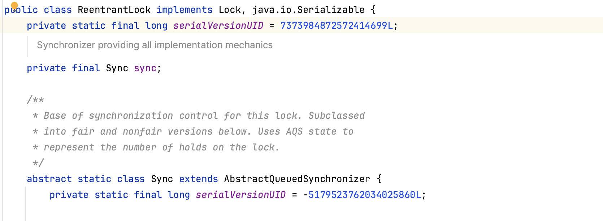

### 核心基石：AQS (AbstractQueuedSynchronizer)

AQS 是一个用于构建锁和同步器的框架。它内部维护了几个关键元素：

- **`state` (一个 `volatile int` 变量):** 这是同步状态的核心。在 `ReentrantLock` 中，`state` 用来表示锁的“重入”次数。

  - `state == 0`: 表示锁未被任何线程持有。
  - `state > 0`: 表示锁已被某个线程持有。这个值就是该线程成功 `lock()` 的次数。

  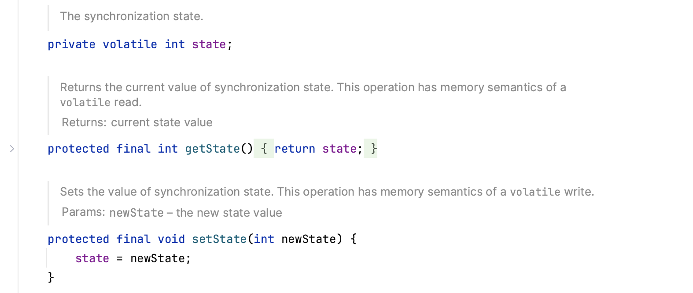

- **一个持有锁的线程 (`exclusiveOwnerThread`):** AQS 内部通过 `setExclusiveOwnerThread()` 和 `getExclusiveOwnerThread()` 方法来记录和获取当前持有锁的线程。

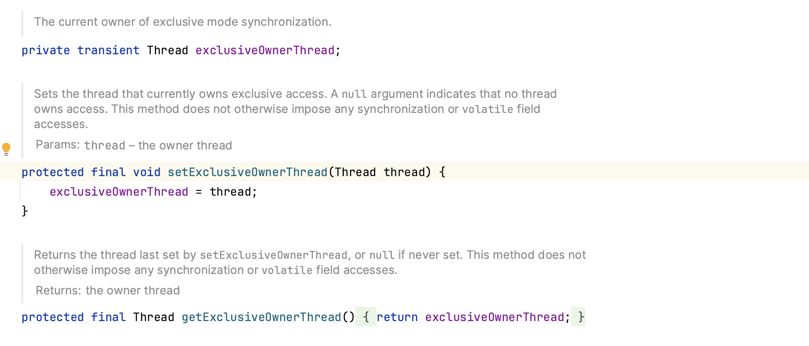

- **一个等待队列 (CLH 队列的变体):** 这是一个先进先出（FIFO）的双向队列，用于存放那些未能获取到锁而被阻塞的线程。队列中的每个节点（`Node`）都封装了一个等待的线程

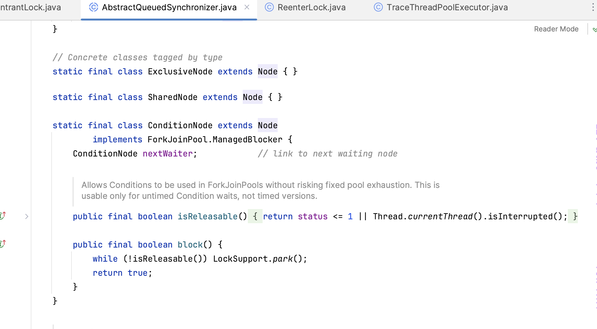

`ReentrantLock` 的 `lock` 和 `unlock` 操作，实际上是委托给了内部 `Sync` 对象（也就是 AQS）的 `acquire` 和 `release` 方法来完成

### lock() 方法：一场惊心动魄的锁竞争

`lock()` 的目标是获取锁。如果获取不到，线程就会被阻塞，直到成功获取。这个过程根据公平与否，略有不同

#### 非公平锁 (`NonfairSync`) 的 `lock()` 实现

这是 `ReentrantLock` 的默认模式，追求的是更高的吞吐量。**一句话总结：新来的线程直接插队，尝试抢锁，抢不到再乖乖排队。**

**源码调用链路：`lock()` -> `initialTryLock` ->`nonfairTryAcquire`-> `acquire()`**

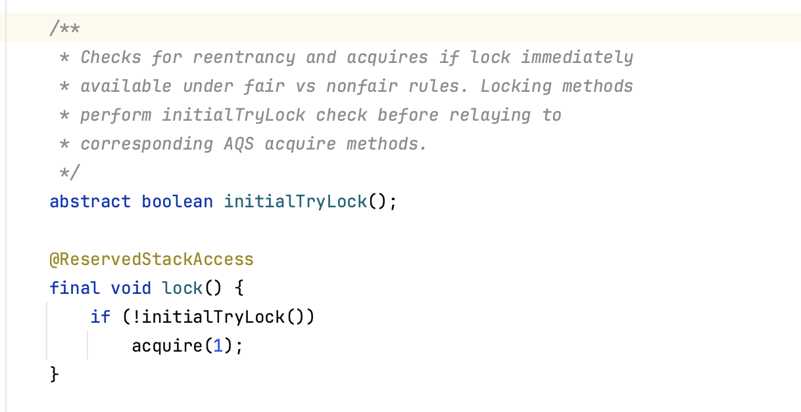

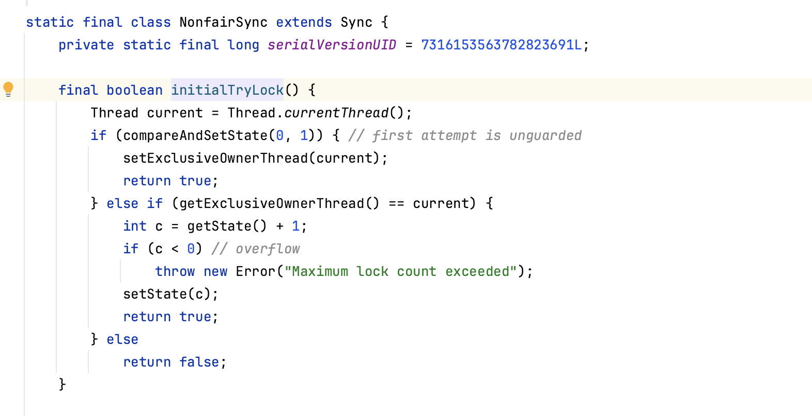

##### **详细步骤分解：**

1. **首次尝试 (CAS 插队):**

   - 当一个线程调用 `lock()` 时，它会首先通过 **CAS (Compare-And-Swap)** 操作，尝试将 `state` 从 0 修改为 1。
   - **如果成功**，意味着此时没有其他线程持有锁，该线程就成功“插队”获取了锁。同时，AQS 会将 `exclusiveOwnerThread` 设置为当前线程。整个 `lock()` 过程结束，非常高效。
   - **如果失败**，说明锁已经被其他线程持有，进入下一步。

2. **处理重入或进入队列:**

   - 程序会调用 `acquire(1)` 方法。这个方法内部会再次尝试获取锁。
   - **检查是否重入：** 首先判断当前持有锁的线程（`getExclusiveOwnerThread()`）是否就是当前线程自己。
     - **如果是**，那么这就是一次“重入”。它会安全地将 `state` 的值加 1，然后成功返回。这也是 `ReentrantLock`（可重入锁）名字的由来。
     - **如果不是**，说明锁被其他线程占用，该线程获取锁失败。

3. **入队与阻塞:**

   - 获取锁失败的线程会被封装成一个 `Node` 对象，并加入到 AQS 等待队列的 **队尾**。
   - 加入队列后，线程并不会立即阻塞，而是会进行“自旋”尝试。在自旋过程中，它会再次检查自己是否可以获得锁（比如前一个节点释放了锁）。
   - 如果多次自旋后仍然无法获取锁，最终线程会通过 `LockSupport.park(this)` 方法被 **挂起（park）**，进入休眠状态，等待被唤醒

   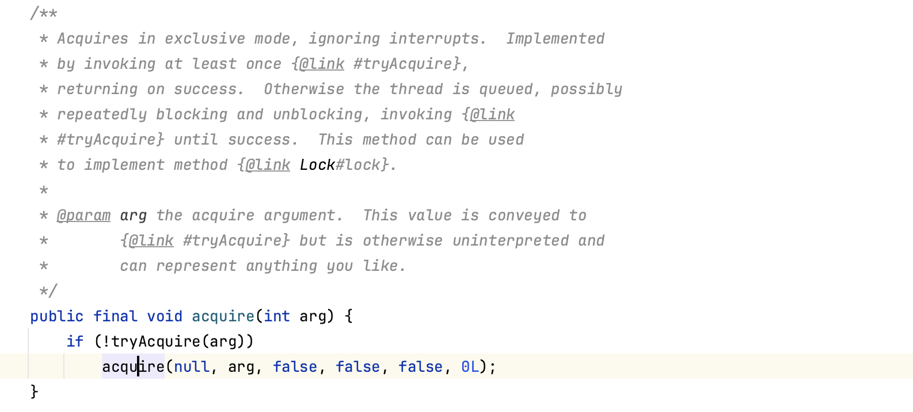

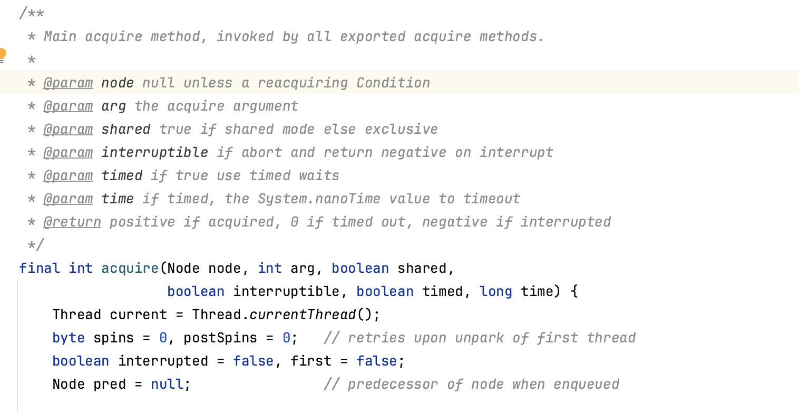

下面注释是

重复执行以下步骤：

- 检查节点是否现在是第一个
- 如果是，确保头节点稳定，否则确保有有效的 predecessor
- 如果节点是第一个或尚未入队，尝试获取
- 否则，如果节点尚未创建，则创建它
- 否则，如果尚未入队，尝试一次入队
- 否则，如果从 park 状态被唤醒，重试（最多 postSpins 次）
- 否则，如果未设置 WAITING 状态，设置并重试
- 否则，park 并清除 WAITING 状态，然后检查取消情况

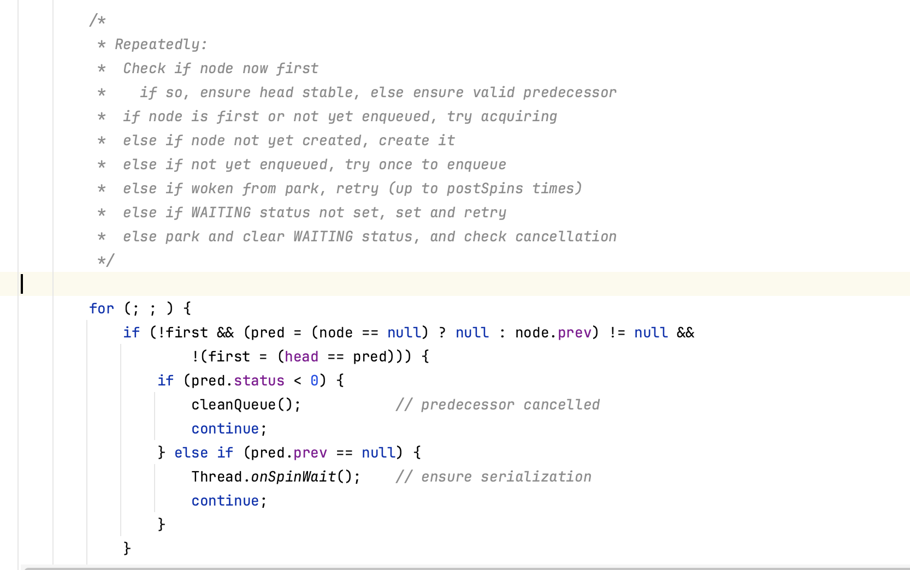

#### 公平锁 (`FairSync`) 的 `lock()` 实现

公平锁保证了线程获取锁的顺序与它们发出请求的顺序一致。

**一句话总结：新来的线程先看一眼等待队列，如果有人在排队，就必须去队尾排队。**

**源码调用链路：`lock()` -> `tryAcquire()` -> `acquire()`**

**详细步骤分解：**

1. **检查等待队列 (唯一的区别):**

   - 与非公平锁不同，当一个线程调用 `lock()` 时，它首先会检查 AQS 的等待队列中 **是否存在正在等待的线程**（通过 `hasQueuedPredecessors()` 方法）。
   - **如果队列中已经有其他线程在等待**，那么为了保证公平，当前线程 **不会尝试获取锁**，而是直接进入下面的入队流程。
   - **如果队列是空的**，它才会像非公平锁一样，尝试通过 CAS 获取锁。

   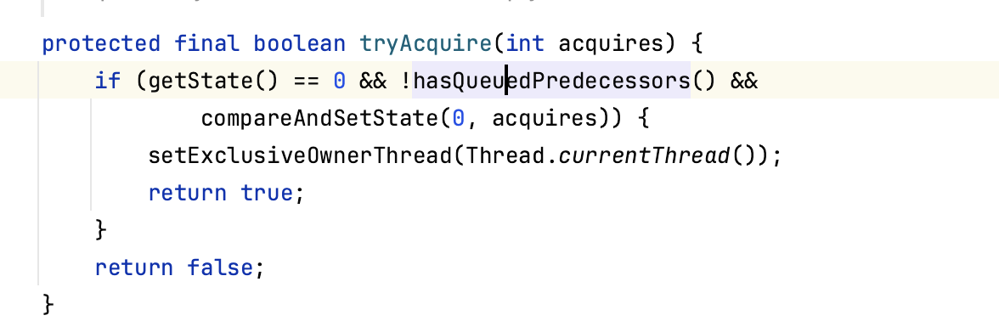

2. **后续流程 (与非公平锁类似):**

   - 如果尝试获取锁失败，或者因为队列中已有等待者而放弃尝试，接下来的流程就和非公平锁一样了：判断是否可重入、入队、自旋、最后被挂起

### `unlock()` 方法：释放锁并唤醒他人

`unlock()` 的过程相对简单，它的核心职责是释放锁，并在锁被完全释放后，唤醒等待队列中的下一个线程。

**源码调用链路：`unlock()` -> `sync.release(1)`**

**详细步骤分解：**

1. **检查线程合法性:**

   - `unlock()` 方法首先会检查当前线程是否就是持有锁的线程（`getExclusiveOwnerThread()`）。如果不是，直接抛出 `IllegalMonitorStateException` 异常。这防止了非锁持有者线程错误地释放锁。

2. **状态递减:**

   - 如果是持有者，程序会安全地将 `state` 的值减 1。这一步并不会使用 CAS，因为只有一个线程（锁的持有者）可以执行这个操作，不存在竞争。

3. **判断是否完全释放:**

   - `state` 减 1 后，会检查其值是否变为 0。
     - **如果 `state` 仍大于 0**，说明这是一个重入锁的内层释放，锁并没有被完全释放，`unlock` 方法直接返回，其他等待线程不会被唤醒。
     - **如果 `state` 等于 0**，说明锁已经被 **完全释放**。

4. **唤醒等待者:**

   - 当 `state` 变为 0 时，AQS 会将 `exclusiveOwnerThread` 设置为 `null`。
   - 然后，它会查看等待队列的头节点（Head Node），并唤醒其后继节点（Head's next Node）中封装的线程。
   - 被唤醒的线程会从 `LockSupport.park()` 的休眠中醒来，再次尝试获取锁。由于此时锁已被释放，它通常能够成功获取锁，成为新的锁持有者

   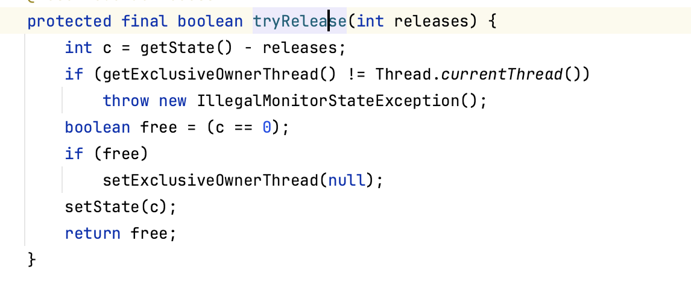
