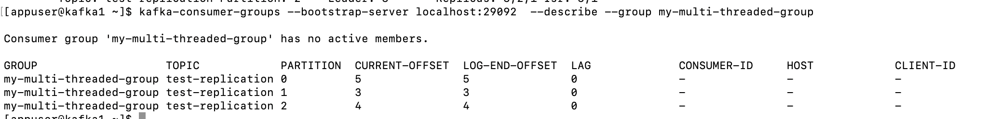

### 什么是副本机制？

所谓的副本机制（Replication），也可以称之为备份机制，通常是指分布式系统在多台网络互联的机器上保存有相同的数据拷贝

1. **提供数据冗余**。即使系统部分组件失效，系统依然能够继续运转，因而增加了整体可用性以及数据持久性。
2. **提供高伸缩性**。支持横向扩展，能够通过增加机器的方式来提升读性能，进而提高读操作吞吐量。
3. **改善数据局部性**。允许将数据放入与用户地理位置相近的地方，从而降低系统延时。

这些优点都是在分布式系统教科书中最常被提及的，但是有些遗憾的是，对于Apache Kafka而言，目前只能享受到副本机制带来的第1个好处，也就是提供数据冗余实现高可用性和高持久性

Kafka是有主题概念的，而每个主题又进一步划分成若干个分区。副本的概念实际上是在分区层级下定义的，每个分区配置有若干个副本。

**所谓副本（Replica），本质就是一个只能追加写消息的提交日志**。根据Kafka副本机制的定义，同一个分区下的所有副本保存有相同的消息序列，这些副本分散保存在不同的Broker上，从而能够对抗部分Broker宕机带来的数据不可用。

在实际生产环境中，每台Broker都可能保存有各个主题下不同分区的不同副本，因此，单个Broker上存有成百上千个副本的现象是非常正常的，接下来我们来看一张图，它展示的是一个有3台Broker的Kafka集群上的副本分布情况。从这张图中，我们可以看到，主题1分区0的3个副本分散在3台Broker上，其他主题分区的副本也都散落在不同的Broker上，从而实现数据冗余


**Leader**: 负责处理该分区所有读写请求的 Broker 。

**Replicas**: 该分区所有副本所在的 Broker ID 列表。

**Isr**: "in-sync" 副本列表。只有这个列表里的副本被认为是与 Leader 完全同步的，可以随时被选举为新的 Leader

从图片可以看出，test-replication主题有三个分区，分别是0，1，2，0分区的leader为1，1分区的leader为2，2分区的leader为3

### 副本内容如何保持一致？

既然分区下能够配置多个副本，而且这些副本的内容还要一致，那么很自然的一个问题就是：我们该如何确保副本中所有的数据都是一致的呢？特别是对Kafka而言，当生产者发送消息到某个主题后，消息是如何同步到对应的所有副本中的呢？针对这个问题，最常见的解决方案就是采用**基于领导者（Leader-based）的副本机制**。Apache Kafka就是这样的设计

第一，在Kafka中，副本分成两类：领导者副本（Leader Replica）和追随者副本（Follower Replica）。每个分区在创建时都要选举一个副本，称为领导者副本，其余的副本自动称为追随者副本。上面图片中的Leader是领导者副本，Repilcas是追随者副本，有多个

第二，Kafka的副本机制比其他分布式系统要更严格一些。在Kafka中，追随者副本是不对外提供服务的。这就是说，任何一个追随者副本都不能响应消费者和生产者的读写请求。所有的请求都必须由领导者副本来处理，或者说，所有的读写请求都必须发往领导者副本所在的Broker，由该Broker负责处理。追随者副本不处理客户端请求，它唯一的任务就是从领导者副本**异步拉取**消息，并写入到自己的提交日志中，从而实现与领导者副本的同步。

第三，当领导者副本挂掉了，或者说领导者副本所在的Broker宕机时，Kafka依托于ZooKeeper提供的监控功能能够实时感知到，并立即开启新一轮的领导者选举，从追随者副本中选一个作为新的领导者。老Leader副本重启回来后，只能作为追随者副本加入到集群中

### 模拟broker宕机，Leader重新选举

分区 0 和 1 的 Leader 分别是 Broker 1 和 2。我们把 **Broker 2** 停掉。 Zookeeper 会检测到 `kafka2` 已下线并触发 Leader 重新选举


可以看到分区1的leader变为broker 1了

### 怎么才算同步？

追随者副本不提供服务，只是定期地异步拉取领导者副本中的数据而已。既然是异步的，就存在着不可能与Leader实时同步的风险。在探讨如何正确应对这种风险之前，我们必须要精确地知道同步的含义是什么。或者说，Kafka要明确地告诉我们，追随者副本到底在什么条件下才算与Leader同步。

基于这个想法，Kafka引入了In-sync Replicas，也就是所谓的ISR副本集合。I**SR中的副本都是与Leader同步的副本，相反，不在ISR中的追随者副本就被认为是与Leader不同步的**。那么，到底什么副本能够进入到ISR中呢？

我们首先要明确的是，Leader副本天然就在ISR中（图中可以看到）。也就是说，**ISR不只是追随者副本集合，它必然包括Leader副本。甚至在某些情况下，ISR只有Leader这一个副本**，如果Leader副本当前写入了10条消息，Follower1副本同步了其中的6条消息，而Follower2副本只同步了其中的3条消息。现在，请你思考一下，对于这2个追随者副本，你觉得哪个追随者副本与Leader不同步？

答案是，要根据具体情况来定。换成英文，就是那句著名的“It depends”。看上去好像Follower2的消息数比Leader少了很多，它是最有可能与Leader不同步的。的确是这样的，但仅仅是可能。

事实上，这2个Follower副本都有可能与Leader不同步，但也都有可能与Leader同步。也就是说，Kafka判断Follower是否与Leader同步的标准，不是看相差的消息数，而是另有“玄机”，**这个标准就是Broker端参数replica.lag.time.max.ms参数值**。这个参数的含义是Follower副本能够落后Leader副本的最长时间间隔，当前默认值是10秒。这就是说，只要一个Follower副本落后Leader副本的时间不连续超过10秒，那么Kafka就认为该Follower副本与Leader是同步的，即使此时Follower副本中保存的消息明显少于Leader副本中的消息。

我们在前面说过，Follower副本唯一的工作就是不断地从Leader副本拉取消息，然后写入到自己的提交日志中。如果这个同步过程的速度持续慢于Leader副本的消息写入速度，那么在replica.lag.time.max.ms时间后，此Follower副本就会被认为是与Leader副本不同步的，因此不能再放入ISR中。此时，Kafka会自动收缩ISR集合，将该副本“踢出”ISR。

值得注意的是，倘若该副本后面慢慢地追上了Leader的进度，那么它是能够重新被加回ISR的。这也表明，ISR是一个动态调整的集合，而非静态不变的

### Unclean领导者选举（Unclean Leader Election）

既然ISR是可以动态调整的，那么自然就可以出现这样的情形：ISR为空。因为Leader副本天然就在ISR中，如果ISR为空了，就说明Leader副本也“挂掉”了，Kafka需要重新选举一个新的Leader。可是ISR是空，此时该怎么选举新Leader呢？

**Kafka把所有不在ISR中的存活副本都称为非同步副本**。通常来说，非同步副本落后Leader太多，因此，如果选择这些副本作为新Leader，就可能出现数据的丢失。毕竟，这些副本中保存的消息远远落后于老Leader中的消息。在Kafka中，选举这种副本的过程称为Unclean领导者选举。**Broker端参数unclean.leader.election.enable控制是否允许Unclean领导者选举**。

开启Unclean领导者选举可能会造成数据丢失，但好处是，它使得分区Leader副本一直存在，不至于停止对外提供服务，因此提升了高可用性。反之，禁止Unclean领导者选举的好处在于维护了数据的一致性，避免了消息丢失，但牺牲了高可用性。

如果你听说过CAP理论的话，你一定知道，一个分布式系统通常只能同时满足一致性（Consistency）、可用性（Availability）、分区容错性（Partition tolerance）中的两个。显然，在这个问题上，Kafka赋予你选择C或A的权利。

你可以根据你的实际业务场景决定是否开启Unclean领导者选举。不过，我强烈建议你**不要**开启它，毕竟我们还可以通过其他的方式来提升高可用性。如果为了这点儿高可用性的改善，牺牲了数据一致性，那就非常不值当了

### Kafka消息大量堆积问题

#### 1.定位问题根源

消息堆积的直接原因是消费速度跟不上生产速度。问题可能出在**消费者（Consumer）、消息队列本身（Broker）或生产者（Producer）**，首先，需要查看**消费者**的消费延迟（Consumer Lag）。这是最核心的监控指标，指的是消费者当前消费的消息位移（Offset）与分区最新消息位移的差值

```sh
bin/kafka-consumer-groups.sh --bootstrap-server <broker_list> --describe --group <group_name>
```



观察输出中的 `LAG` 列。如果 `LAG` 值持续增大，说明消费速度跟不上，

根据消费延迟，可以初步判断问题：

- **特定Topic或特定分区延迟高**：很可能是该Topic的消费者或该分区所在的Broker有问题。
- **所有消费者组都延迟**：可能是整个Kafka集群或下游通用服务（如数据库、缓存）出现了问题

#### 2.分析具体原因

消费者处理能力不足是消息堆积最常见的原因。

- **消费逻辑过重**：消费者在处理每条消息时，执行了耗时很长的操作，如复杂的计算、调用外部接口、大量的数据库操作等。

  解决方案

  - **优化消费逻辑**：代码层面优化，减少不必要的计算，批量处理数据库操作，异步调用外部接口。

  - 增加并发度

    1.**增加消费者实例**：如果当前消费者实例数小于分区数，可以增加消费者实例，Kafka会自动进行重平衡（Rebalance），让新的消费者分担分区。

    2.**增加分区数**：如果消费者实例数已经等于分区数，可以考虑增加Topic的分区数，并相应增加消费者实例。

    3.**多线程处理**：在单个消费者内部使用线程池来并发处理消息，提高处理能力。

- **消费者频繁发生重平衡（Rebalance）**：消费者组成员的频繁加入和退出会导致Rebalance，期间整个消费者组会停止消费。

  - **原因**：`session.timeout.ms` 和 `heartbeat.interval.ms` 配置不当、消费者实例频繁重启或Full GC。
  - **解决方案**：适当调大 `session.timeout.ms`，确保 `heartbeat.interval.ms` 远小于 `session.timeout.ms`。同时排查消费者应用自身的不稳定因素。

- **消费者消费能力不均**：由于分区分配策略（如RangeAssignor）或消息key的哈希不均，导致某些消费者分配了更多的分区或处理了更多的热点数据。

  - **解决方案**：尝试更换为更均衡的分区分配策略，如 `RoundRobinAssignor` 或 `StickyAssignor`

定位和处理Kafka消息大量堆积问题，通常遵循“**定位问题 -> 分析原因 -> 清理堆积 -> 恢复消费**”的思路。核心在于快速识别瓶颈所在，并采取相应措施。

### 第一步：定位问题根源

消息堆积的直接原因是消费速度跟不上生产速度。问题可能出在**消费者（Consumer）、消息队列本身（Broker）或生产者（Producer）**。

首先，需要查看**消费者**的消费延迟（Consumer Lag）。这是最核心的监控指标，指的是消费者当前消费的消息位移（Offset）与分区最新消息位移的差值。

- **使用命令行工具**：

  Bash

  ```
  bin/kafka-consumer-groups.sh --bootstrap-server <broker_list> --describe --group <group_name>
  ```

  观察输出中的 `LAG` 列。如果 `LAG` 值持续增大，说明消费速度跟不上。

- **使用监控系统**：通过Prometheus、Grafana等监控系统，可以实现对Consumer Lag的图形化监控，更直观地发现问题。

根据消费延迟，可以初步判断问题：

- **特定Topic或特定分区延迟高**：很可能是该Topic的消费者或该分区所在的Broker有问题。
- **所有消费者组都延迟**：可能是整个Kafka集群或下游通用服务（如数据库、缓存）出现了问题。

### 第二-步：分析具体原因

定位到瓶颈所在后，需要进一步分析导致堆积的具体原因。

------

#### 1. 消费者（Consumer）问题

消费者处理能力不足是消息堆积最常见的原因。

- **消费逻辑过重**：消费者在处理每条消息时，执行了耗时很长的操作，如复杂的计算、调用外部接口、大量的数据库操作等。
  - 解决方案
    - **优化消费逻辑**：代码层面优化，减少不必要的计算，批量处理数据库操作，异步调用外部接口。
    - 增加并发度
      - **增加消费者实例**：如果当前消费者实例数小于分区数，可以增加消费者实例，Kafka会自动进行重平衡（Rebalance），让新的消费者分担分区。
      - **增加分区数**：如果消费者实例数已经等于分区数，可以考虑增加Topic的分区数，并相应增加消费者实例。注意，分区数只能增加不能减少。
      - **多线程处理**：在单个消费者内部使用线程池来并发处理消息，提高处理能力。
- **消费者频繁发生重平衡（Rebalance）**：消费者组成员的频繁加入和退出会导致Rebalance，期间整个消费者组会停止消费。
  - **原因**：`session.timeout.ms` 和 `heartbeat.interval.ms` 配置不当、消费者实例频繁重启或Full GC。
  - **解决方案**：适当调大 `session.timeout.ms`，确保 `heartbeat.interval.ms` 远小于 `session.timeout.ms`。同时排查消费者应用自身的不稳定因素。
- **消费者消费能力不均**：由于分区分配策略（如RangeAssignor）或消息key的哈希不均，导致某些消费者分配了更多的分区或处理了更多的热点数据。
  - **解决方案**：尝试更换为更均衡的分区分配策略，如 `RoundRobinAssignor` 或 `StickyAssignor`。

------

#### 2. Kafka Broker问题

Broker是消息中转站，其自身的性能瓶颈也会导致消息堆积。

- **Broker负载过高**：CPU、内存、磁盘I/O、网络带宽等资源达到瓶颈。
  - 解决方案
    - **扩容**：增加Broker节点，将分区迁移到新的节点上，分摊负载。
    - **优化配置**：调整Broker的线程数（如`num.network.threads`, `num.io.threads`）、缓冲区大小等参数。
    - **磁盘性能**：优先使用SSD，避免机械硬盘的随机写性能瓶颈。
- **ISR（In-Sync Replicas）频繁变动**：副本同步效率低，导致Leader和Follower之间数据同步延迟，影响了消息的提交和拉取。
  - **解决方案**：检查网络状况，优化副本同步相关的参数

#### 3. 生产者（Producer）问题

虽然生产者问题直接导致堆积的情况较少，但也会间接影响。

- 瞬间流量过大：生产者在短时间内发送了远超消费者处理能力的消息量。
  - **解决方案**：与业务方沟通，在生产者端进行限流或错峰发送。如果业务上允许，可以适当降低生产速率

定位和处理Kafka消息大量堆积问题，通常遵循“**定位问题 -> 分析原因 -> 清理堆积 -> 恢复消费**”的思路。核心在于快速识别瓶颈所在，并采取相应措施。

### 第一步：定位问题根源

消息堆积的直接原因是消费速度跟不上生产速度。问题可能出在**消费者（Consumer）、消息队列本身（Broker）或生产者（Producer）**。

首先，需要查看**消费者**的消费延迟（Consumer Lag）。这是最核心的监控指标，指的是消费者当前消费的消息位移（Offset）与分区最新消息位移的差值。

- **使用命令行工具**：

  Bash

  ```
  bin/kafka-consumer-groups.sh --bootstrap-server <broker_list> --describe --group <group_name>
  ```

  观察输出中的 `LAG` 列。如果 `LAG` 值持续增大，说明消费速度跟不上。

- **使用监控系统**：通过Prometheus、Grafana等监控系统，可以实现对Consumer Lag的图形化监控，更直观地发现问题。

根据消费延迟，可以初步判断问题：

- **特定Topic或特定分区延迟高**：很可能是该Topic的消费者或该分区所在的Broker有问题。
- **所有消费者组都延迟**：可能是整个Kafka集群或下游通用服务（如数据库、缓存）出现了问题。

### 第二步：分析具体原因

定位到瓶颈所在后，需要进一步分析导致堆积的具体原因。

------

#### 1. 消费者（Consumer）问题

消费者处理能力不足是消息堆积最常见的原因。

- **消费逻辑过重**：消费者在处理每条消息时，执行了耗时很长的操作，如复杂的计算、调用外部接口、大量的数据库操作等。
  - 解决方案
    - **优化消费逻辑**：代码层面优化，减少不必要的计算，批量处理数据库操作，异步调用外部接口。
    - 增加并发度
      - **增加消费者实例**：如果当前消费者实例数小于分区数，可以增加消费者实例，Kafka会自动进行重平衡（Rebalance），让新的消费者分担分区。
      - **增加分区数**：如果消费者实例数已经等于分区数，可以考虑增加Topic的分区数，并相应增加消费者实例。注意，分区数只能增加不能减少。
      - **多线程处理**：在单个消费者内部使用线程池来并发处理消息，提高处理能力。

- **消费者频繁发生重平衡（Rebalance）**：消费者组成员的频繁加入和退出会导致Rebalance，期间整个消费者组会停止消费。

  - **原因**：`session.timeout.ms` 和 `heartbeat.interval.ms` 配置不当、消费者实例频繁重启或Full GC。
  - **解决方案**：适当调大 `session.timeout.ms`，确保 `heartbeat.interval.ms` 远小于 `session.timeout.ms`。同时排查消费者应用自身的不稳定因素。

- **消费者消费能力不均**：由于分区分配策略（如RangeAssignor）或消息key的哈希不均，导致某些消费者分配了更多的分区或处理了更多的热点数据。

  - **解决方案**：尝试更换为更均衡的分区分配策略，如 `RoundRobinAssignor` 或 `StickyAssignor`。

------

#### 2. Kafka Broker问题

Broker是消息中转站，其自身的性能瓶颈也会导致消息堆积。

- **Broker负载过高**：CPU、内存、磁盘I/O、网络带宽等资源达到瓶颈。
  - 解决方案
    - **扩容**：增加Broker节点，将分区迁移到新的节点上，分摊负载。
    - **优化配置**：调整Broker的线程数（如`num.network.threads`, `num.io.threads`）、缓冲区大小等参数。
    - **磁盘性能**：优先使用SSD，避免机械硬盘的随机写性能瓶颈。

- **ISR（In-Sync Replicas）频繁变动**：副本同步效率低，导致Leader和Follower之间数据同步延迟，影响了消息的提交和拉取。

  - **解决方案**：检查网络状况，优化副本同步相关的参数。

------

#### 3. 生产者（Producer）问题

虽然生产者问题直接导致堆积的情况较少，但也会间接影响。

- 瞬间流量过大
  生产者在短时间内发送了远超消费者处理能力的消息量。
  - **解决方案**：与业务方沟通，在生产者端进行限流或错峰发送。如果业务上允许，可以适当降低生产速率。

### 第三步：处理已堆积的消息

在解决了消费能力瓶颈后，需要对已经堆积的大量消息进行处理。

- **临时扩容，加速消费**：临时增加消费者实例数量，甚至可以临时部署一个专门用于“清理”堆积消息的消费者应用，待堆积处理完毕后再缩容。这是最常用且有效的方法。

- **消息转存**：编写一个临时程序，将堆积的消息从Kafka中消费出来，转存到其他存储（如HDFS、S3），后续再离线分析处理

- **丢弃不重要的消息**：如果业务允许，可以临时将消费位移（Offset）重置到最新的位置，跳过堆积的消息。这种方法有数据丢失风险，必须谨慎评估

  ```sh
  bin/kafka-consumer-groups.sh --bootstrap-server <broker_list> --group <group_name> --reset-offsets --to-latest --topic <topic_name> --execute
  ```

