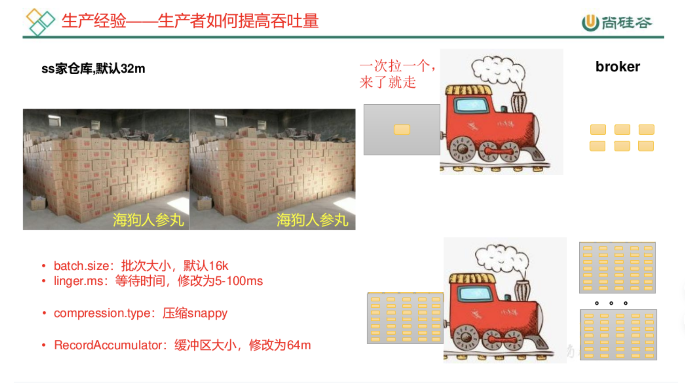
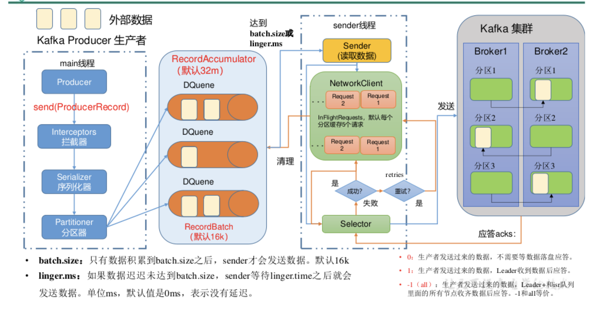
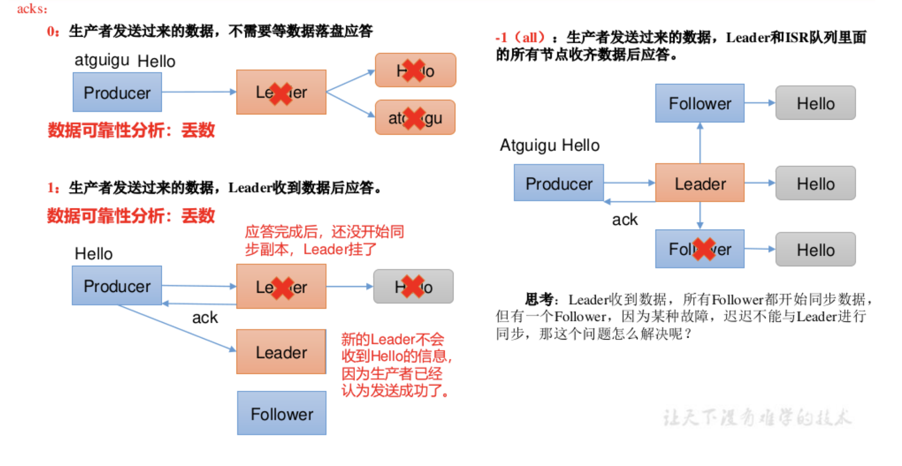
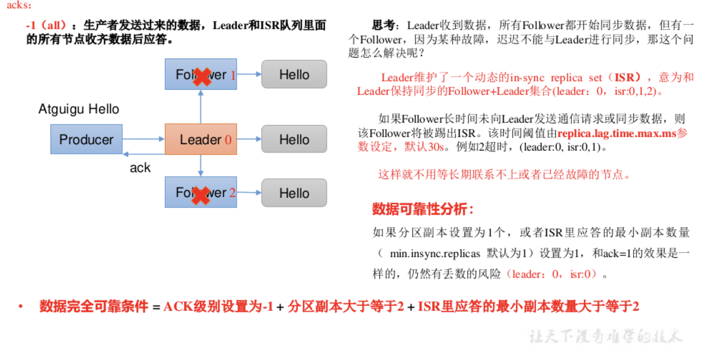
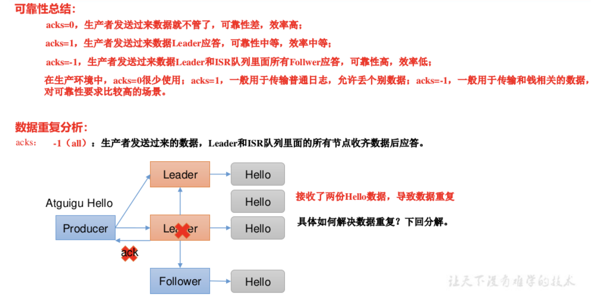
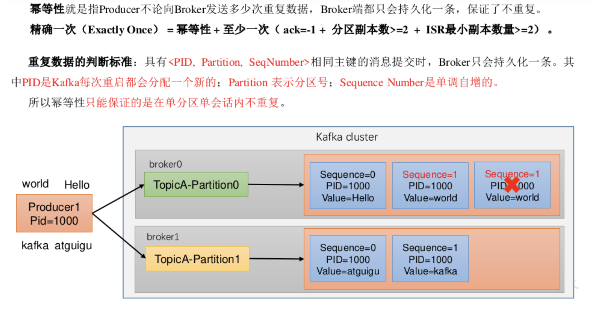
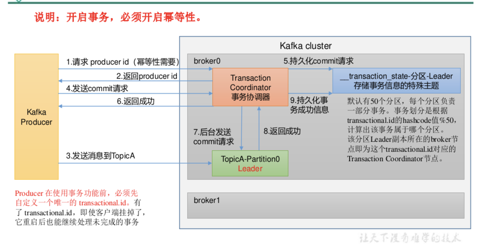
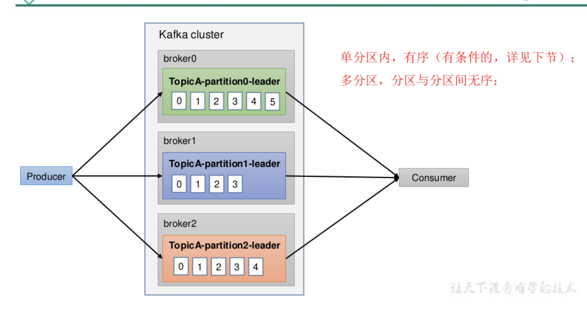

#### kafka生产经验
1. 生产经验----->生产者提高吞吐量

  
```
Properties properties = new Properties();
// 2. 给kafka 配置对象添加配置信息：bootstrap.servers
properties.put(ProducerConfig.BOOTSTRAP_SERVERS_CONFIG,
"hadoop102:9092");
// key,value 序列化（必须）：key.serializer，value.serializer
properties.put(ProducerConfig.KEY_SERIALIZER_CLASS_CONFIG,
"org.apache.kafka.common.serialization.StringSerializer");
properties.put(ProducerConfig.VALUE_SERIALIZER_CLASS_CONFIG,
"org.apache.kafka.common.serialization.StringSerializer");
// batch.size：批次大小，默认16K
properties.put(ProducerConfig.BATCH_SIZE_CONFIG, 16384);
// linger.ms：等待时间，默认0
properties.put(ProducerConfig.LINGER_MS_CONFIG, 1);
// RecordAccumulator：缓冲区大小，默认32M：buffer.memory
properties.put(ProducerConfig.BUFFER_MEMORY_CONFIG,33554432);
// compression.type：压缩，默认 none，可配置值 gzip、snappy、
lz4和 zstd
properties.put(ProducerConfig.COMPRESSION_TYPE_CONFIG,"snappy");
// 3. 创建 kafka生产者对象
KafkaProducer<String, String> kafkaProducer = new
KafkaProducer<String, String>(properties);
// 4. 调用 send方法,发送消息
for (int i = 0; i < 5; i++) {
kafkaProducer.send(new
ProducerRecord<>("first","atguigu " + i));
}
// 5. 关闭资源
kafkaProducer.close();
}
}
```
2. 生产经验----->数据可靠性
- 发送流程



- ACK应答级别
  
  
  

```
// 1. 创建 kafka生产者的配置对象
Properties properties = new Properties();
// 2. 给kafka 配置对象添加配置信息：bootstrap.servers
properties.put(ProducerConfig.BOOTSTRAP_SERVERS_CONFIG,
"hadoop102:9092");
// key,value 序列化（必须）：key.serializer，value.serializer
properties.put(ProducerConfig.KEY_SERIALIZER_CLASS_CONFIG,
StringSerializer.class.getName());
properties.put(ProducerConfig.VALUE_SERIALIZER_CLASS_CONFIG,
StringSerializer.class.getName());
// 设置acks
properties.put(ProducerConfig.ACKS_CONFIG, "all");
// 重试次数retries，默认是int最大值，2147483647
properties.put(ProducerConfig.RETRIES_CONFIG, 3);
// 3. 创建 kafka生产者对象
KafkaProducer<String, String> kafkaProducer = new
KafkaProducer<String, String>(properties);
// 4. 调用 send方法,发送消息
for (int i = 0; i < 5; i++) {
kafkaProducer.send(new
ProducerRecord<>("first","atguigu " + i));
}
// 5. 关闭资源
kafkaProducer.close();
}
}
```
3. 生产经验----->数据去重
**- 数据传输语义**
至少一次（At Least Once）= ACK级别设置为-1 +分区副本大于等于2 + ISR里应答的最小副本数量大于等于2
最多一次（At Most Once）= ACK级别设置为0
总结：
At Least Once可以保证数据不丢失，但是不能保证数据不重复；
At Most Once可以保证数据不重复，但是不能保证数据不丢失。
精确一次（Exactly Once）：对于一些非常重要的信息，比如和钱相关的数据，要求数据既不能重复也不丢失。
Kafka 0.11版本以后，引入了一项重大特性：幂等性和事务。
**- 幂等性**

**- 生产者事务**

4. 生产经验----->数据有序



