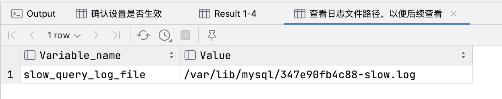
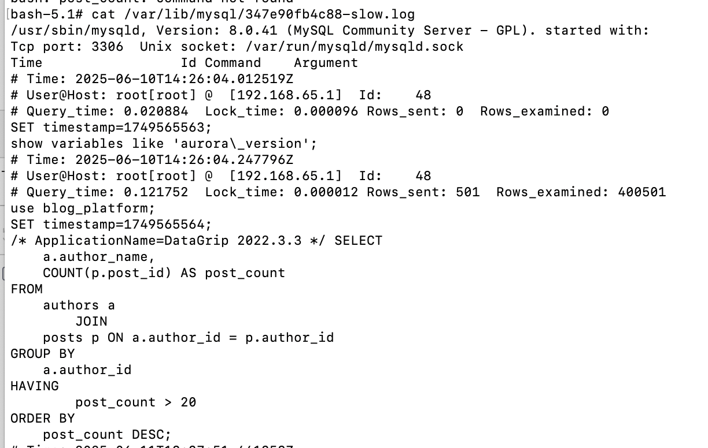

我们经常提到SQL执行计划去优化SQL语句，但是这些需要优化的SQL语句到底是怎么定位的呢？总不可能每一条都去测试吧，这篇文章主题就是关于如何定位慢SQL

## The Slow Query Log（慢查询日志）

### 什么是慢查询日志？

MySQL 会记录执行时间过长的 SQL 语句，这项功能被称为**慢查询日志 (Slow Query Log)**。慢查询日志是一个非常有用的工具，可以帮助数据库管理员和开发人员识别出效率低下的查询，从而进行针对性的优化，提升数据库性能

### 特点

**可配置性**: 你可以自定义"慢"的阈值。通过设置 `long_query_time` 参数（单位为秒），可以定义执行时间超过多少的查询才被记录。例如，设置为 `1`，则执行时间超过 1 秒的查询都会被记录下来。

**开关控制**: 你可以随时开启或关闭慢查询日志功能。通过设置 `slow_query_log` 为 `ON` 或 `OFF` 来控制。

**日志内容**: 日志中会详细记录慢查询的相关信息，帮助你分析问题：

- **执行时间 (Query_time)**: 查询总共花费的时间。
- **锁定时间 (Lock_time)**: 等待表锁定的时间。
- **发送行数 (Rows_sent)**: 返回给客户端的行数。
- **检查行数 (Rows_examined)**: 为了找到结果集而扫描的行数。
- **执行用户和主机**: 是哪个用户从哪个 IP 地址执行的查询。
- **执行时间点**: 查询发生的具体时间。
- **SQL 语句本身**: 完整的 SQL 查询语句

### 如何启用和配置？

#### 方式一：修改配置文件

在你的 MySQL 配置文件中的 `[mysqld]` 部分，添加或修改以下参数：

```
slow_query_log = 1
slow_query_log_file = /var/log/mysql/mysql-slow.log
long_query_time = 1
# 可选：记录没有使用索引的查询
# log_queries_not_using_indexes = 1
```

`slow_query_log = 1`: `1` 代表开启，`0` 代表关闭。

`slow_query_log_file`: 指定日志文件的存放路径。请确保 MySQL 用户有权限写入该文件。

`long_query_time = 1`: 设置超过 1 秒的查询为慢查询

修改配置文件后，需要重启 MySQL 服务才能生效。

#### 方式二：动态设置 (临时)

你也可以在不重启服务的情况下，通过 MySQL 客户端动态设置，但这只在当前服务运行期间有效，重启后会失效。

```
-- 开启慢查询日志
SET GLOBAL slow_query_log = 'ON';

-- 设置慢查询的时间阈值为 2 秒
SET GLOBAL long_query_time = 2;

-- 查看慢查询日志文件的位置
SHOW VARIABLES LIKE 'slow_query_log_file';
```

### 案例测试

**场景**: 一个简单的博客平台。平台上有 `authors` (作者) 表和 `posts` (文章) 表。我们需要在首页展示一个 “热门作者列表”，条件是：显示发布了超过 20 篇文章的作者及其总文章数。随着平台数据量的增长，用户抱怨首页加载越来越慢

#### 第 1 步：创建表和模拟数据

首先，我们创建所需的表，并插入大量模拟数据来重现问题。一个数据量很小的数据库通常不会暴露慢查询问题

1. 创建数据库和表结构

```sql
CREATE DATABASE blog_platform;
USE blog_platform;

-- 作者表
CREATE TABLE authors (
    author_id INT AUTO_INCREMENT PRIMARY KEY,
    author_name VARCHAR(255) NOT NULL,
    registration_date DATE
);

-- 文章表
CREATE TABLE posts (
    post_id INT AUTO_INCREMENT PRIMARY KEY,
    author_id INT NOT NULL,
    post_title VARCHAR(255),
    post_content TEXT,
    creation_date DATETIME DEFAULT CURRENT_TIMESTAMP
    -- 注意：这里的 author_id 没有索引，这是我们故意制造问题的关键
);
```

2. 插入模拟数据

为了让查询变慢，我们需要插入大量数据。这里我们用存储过程来快速生成数据

```sql
-- 创建插入作者的存储过程
DELIMITER $$
CREATE PROCEDURE insert_authors()
BEGIN
    DECLARE i INT DEFAULT 1;
    WHILE i <= 1000 DO
        INSERT INTO authors (author_name, registration_date) VALUES (CONCAT('作者_', i), CURDATE() - INTERVAL i DAY);
        SET i = i + 1;
    END WHILE;
END$$
DELIMITER ;

-- 创建插入文章的存储过程
DELIMITER $$
CREATE PROCEDURE insert_posts()
BEGIN
    DECLARE i INT DEFAULT 1;
    WHILE i <= 200000 DO -- 插入 20 万篇文章
        INSERT INTO posts (author_id, post_title) VALUES (
            FLOOR(1 + RAND() * 1000),  -- 随机关联一个作者
            CONCAT('文章标题_', i)
        );
        SET i = i + 1;
    END WHILE;
END$$
DELIMITER ;

-- 执行存储过程来填充数据
CALL insert_authors();
CALL insert_posts();
```

现在，我们有了一个包含 1000 个作者和 20 万篇文章的数据库。`posts` 表中的 `author_id` 列上**没有索引**。

#### 第 2 步：开启慢查询日志并执行慢 SQL

在执行查询之前，我们先开启慢查询日志，并将阈值设置得比较低（比如 0.5 秒），以便能捕获到我们的目标查询。

在 MySQL 客户端中执行：

```sql
-- 开启慢查询日志 我这里是零时设置
SET GLOBAL slow_query_log = 'ON';
-- 设置慢查询阈值为 0.5 秒
SET GLOBAL long_query_time = 0.5;
-- 确认设置是否生效
SHOW GLOBAL VARIABLES LIKE 'slow_query_log';
SHOW GLOBAL VARIABLES LIKE 'long_query_time';
-- 查看日志文件路径，以便后续查看
SHOW GLOBAL VARIABLES LIKE 'slow_query_log_file';
```



#### 第 3步：执行有问题的 SQL 查询

这就是我们为 “热门作者列表” 编写的查询。

```sql
SELECT
    a.author_name,
    COUNT(p.post_id) AS post_count
FROM
    authors a
JOIN
    posts p ON a.author_id = p.author_id
GROUP BY
    a.author_id
HAVING
    post_count > 20
ORDER BY
    post_count DESC;
```

在有 20 万条文章记录且 `posts.author_id` 没有索引的情况下，这个查询会非常慢。它需要对 `posts` 表进行**全表扫描 (Full Table Scan)** 来为每个作者计算文章数量

#### 第 4步：分析慢查询日志

执行完上面的慢 SQL 后，等待几秒钟，然后去查看你的慢查询日志文件。在 Linux 系统中，你通常可以使用 `cat` 或 `tail` 命令查看



第 5步：后续sql优化，不做赘述
