## 揭开 MyBatis 的神秘面纱：从 SQL 到对象的奇妙旅程

### 前言

对于许多Java开发者来说，MyBatis 是一个熟悉又可靠的老朋友。我们习惯于编写一个 Mapper 接口，然后在 XML 中写下对应的 SQL，神奇的事情就发生了——不需要任何实现类，数据就从数据库流转到了我们的 Java 对象中。但你是否曾停下来思考过，这背后究竟隐藏着怎样的设计与逻辑？

仅仅停留在“会用”的层面，意味着当遇到复杂的性能问题或诡异的 bug 时，我们可能束手无策。理解其底层原理，不仅能让我们成为更好的问题解决者，更能让我们领略到软件设计模式的精妙与优雅。

今天，就让我们一起踏上这场探索之旅，揭开 MyBatis 的神秘面纱，看看从一行代码调用到一次数据库交互，它内部究竟发生了什么。

### 宏观蓝图：认识核心组件

在深入细节之前，我们首先需要认识一下 MyBatis 世界中的几位关键“角色”。正是它们的协同工作，才构成了整个框架的骨架。

- **`Configuration`**：**全局配置总管**。它是一个大管家，MyBatis 启动时解析的所有配置（包括 `mybatis-config.xml` 和所有 Mapper 文件）都被装载到这个唯一的实例中。它是所有后续操作的数据中心。
- **`SqlSessionFactory`**：**重量级的会话工厂**。它基于 `Configuration` 对象被创建，是线程安全的，整个应用的生命周期中通常只存在一个。它的唯一职责就是生产 `SqlSession`。
- **`SqlSession`**：**轻量级的数据库会话**。这是与数据库进行一次交互的直接代表，类似于 JDBC 的 `Connection`。它是**线程不安全**的，因此必须在每次请求时创建，并在使用完毕后立即关闭。
- **`Executor`**：**SQL 执行器**。`SqlSession` 本身并不直接执行 SQL，而是将这个重任委托给 `Executor`。`Executor` 负责管理数据库连接、事务、一级缓存等所有底层操作。
- **`MappedStatement`**：**SQL 指令手册**。XML 中每一个 `<select>`、`<insert>` 等标签，都会被解析成一个 `MappedStatement` 对象，它包含了这条 SQL 的所有信息：SQL 文本、参数类型、返回值类型、缓存配置等。
- **三大处理器 (`StatementHandler`, `ParameterHandler`, `ResultSetHandler`)**：`Executor` 的三个得力助手，分别负责处理语句创建、参数设置和结果集映射。

### 奇妙旅程四部曲：从调用到返回

现在，让我们跟随一次典型的数据库查询 `userMapper.selectUser(1)`，完整地走一遍 MyBatis 的内部旅程。

#### 第一幕：创世纪 - 加载配置与构建工厂

一切始于这行我们无比熟悉的代码：

```java
InputStream inputStream = Resources.getResourceAsStream("mybatis-config.xml");
SqlSessionFactory sqlSessionFactory = new SqlSessionFactoryBuilder().build(inputStream);
```

这短短两行代码的背后，MyBatis 正在进行一场有条不紊的“创世”工程，其核心是**建造者模式（Builder Pattern）**。

1. `SqlSessionFactoryBuilder` 作为一个生命周期短暂的“建筑工”，接收了配置文件的输入流。
2. 它内部会创建一个 `XMLConfigBuilder`，这个“解析大师”开始逐行解析 `mybatis-config.xml`，将`<settings>`, `<plugins>`, `<mappers>` 等所有配置信息，全部装填进一个全局唯一的 `Configuration` 对象。

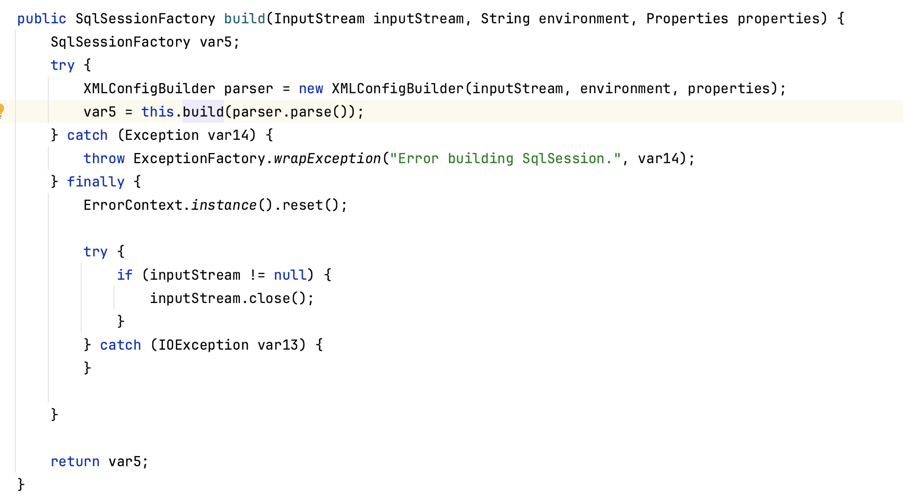

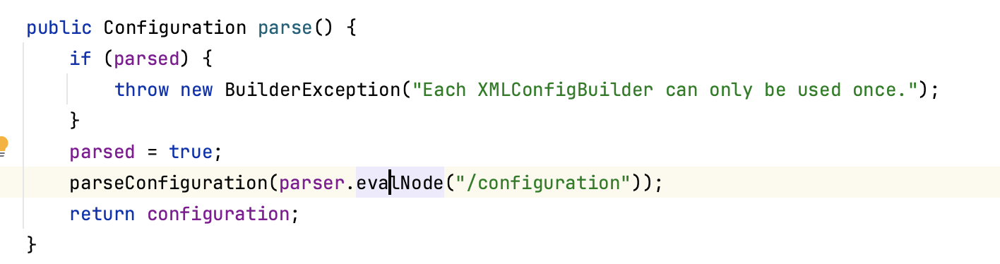

3. 当解析到 `<mappers>` 标签时，它会为每一个 Mapper XML 文件创建一个 `XMLMapperBuilder`。

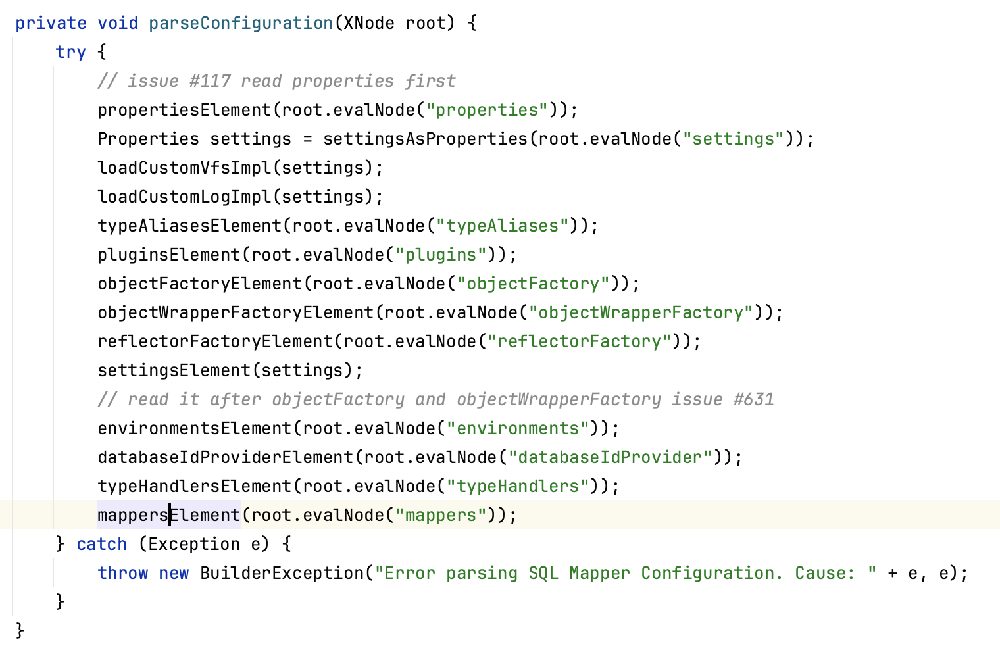

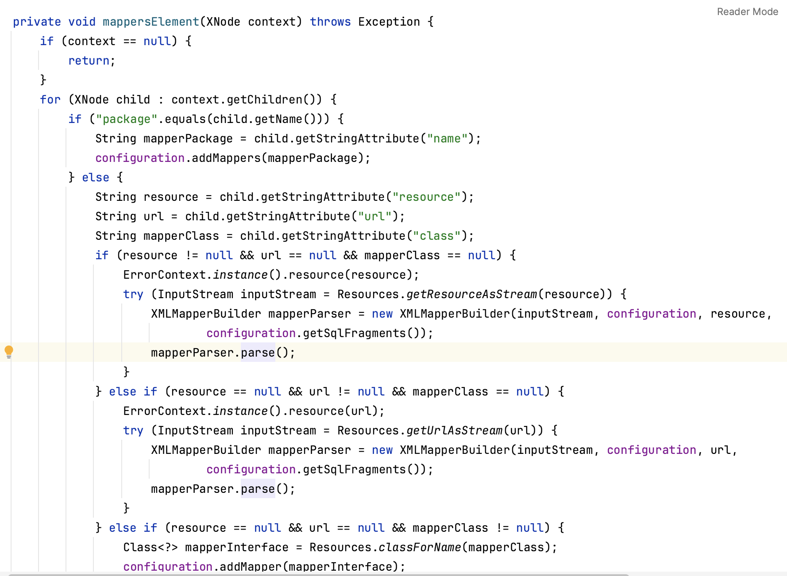


4. `XMLMapperBuilder` 负责将具体的 Mapper XML 文件解析成一个个 `MappedStatement` 对象。这个过程最关键的一步，是为每个 SQL 指令生成一个**全局唯一的ID**。

   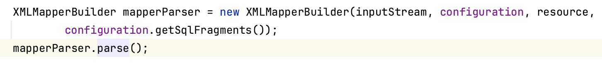

   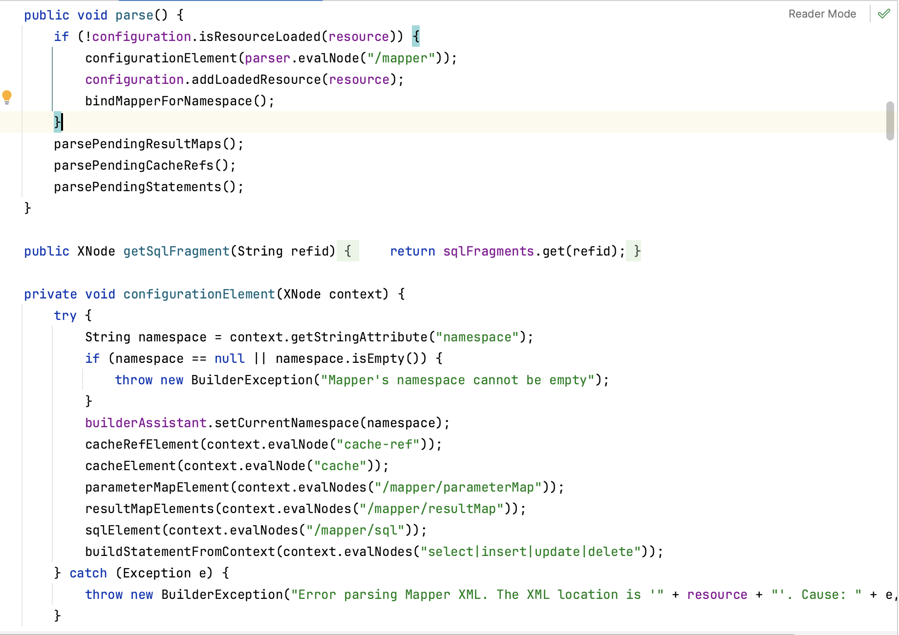

   > ID 生成规则 = namespace + . + SQL标签的id
   >
   > 例如：com.example.mapper.UserMapper.selectUser

 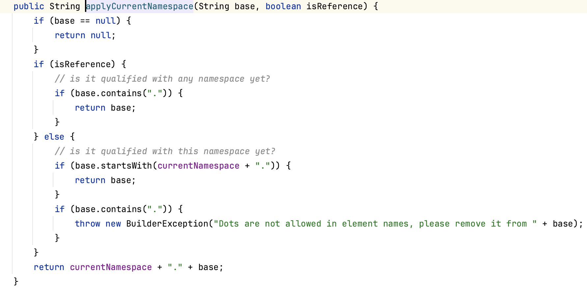

5. 所有 `MappedStatement` 都被注册到 `Configuration` 内部一个巨大的 `Map<String, MappedStatement>` 中，形成了一个完整的指令“地址簿”。

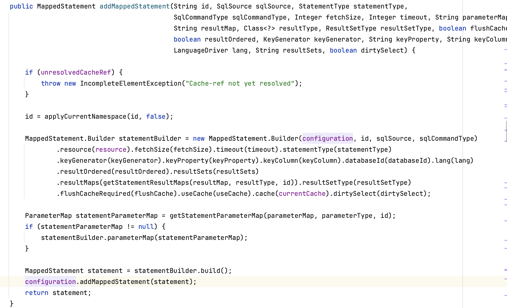

6. 最后，`SqlSessionFactoryBuilder` 根据这个满载信息的 `Configuration` 对象，创建出 `SqlSessionFactory` 并功成身退。


至此，一个包含了所有执行蓝图的重量级工厂已经准备就绪。

#### 第二幕：指尖魔法 - `getMapper` 与动态代理

当我们调用 `UserMapper mapper = session.getMapper(UserMapper.class);` 时，MyBatis 最神奇的部分登场了。我们从未写过 `UserMapper` 的实现类，那这个 `mapper` 对象从何而来？

答案是：**JDK 动态代理 (Dynamic Proxy)**。

1. `session.getMapper()` 会请求 `Configuration` 对象，`Configuration` 内部的 `MapperRegistry` 会为 `UserMapper.class` 这个接口创建一个代理工厂 (`MapperProxyFactory`)。
2. 这个工厂通过 `Proxy.newProxyInstance()` 创造出一个实现了 `UserMapper` 接口的**代理对象**。
3. 这个代理对象的核心是一个名为 `MapperProxy` 的调用处理器 (`InvocationHandler`)。

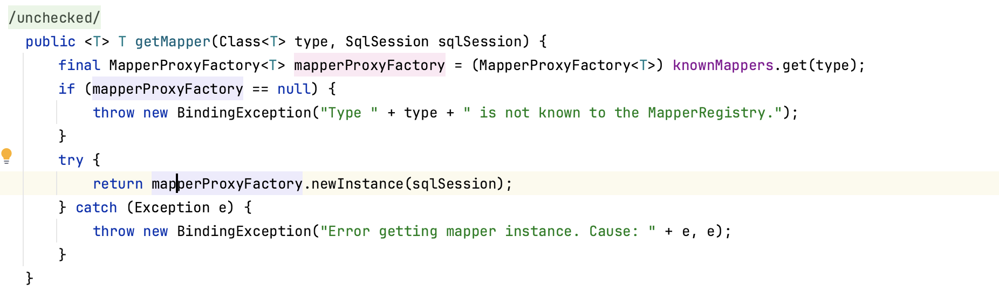

现在，我们拿到的 `mapper` 变量，其实是一个“傀儡”。所有对它方法的调用（如 `mapper.selectUser(1)`），都会被 `MapperProxy` 的 `invoke()` 方法拦截。

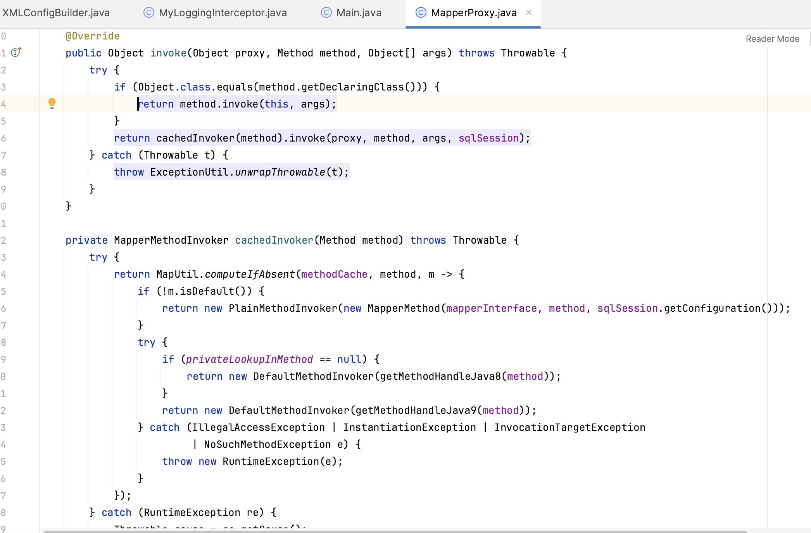

#### 第三幕：深入工坊 - `Executor` 的执行链

`MapperProxy` 拦截到方法调用后，它的使命是找到正确的 SQL 指令并执行它。

1. **动态寻址**：`MapperProxy` 会根据被调用的方法（`selectUser`）和它所属的接口（`com.example.mapper.UserMapper`），动态地拼接出那个全局唯一的 ID：“`com.example.mapper.UserMapper.selectUser`”。

2. **查找指令**：它拿着这个 ID，去 `Configuration` 的“地址簿”中，准确地找到了对应的 `MappedStatement` 对象。
    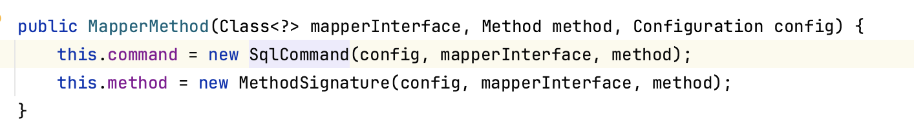
    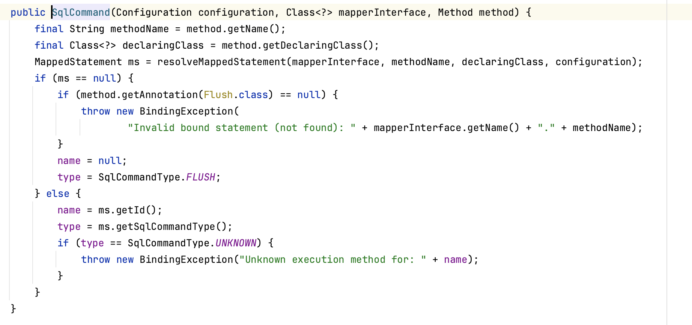

3. **委托执行**：`MapperProxy` 将 ID 和参数（`id=1`）传递给 `SqlSession`。`SqlSession` 再次将任务委托给真正的劳动者——`Executor`。
    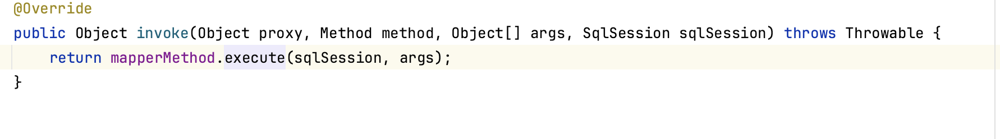
    `Executor` 的工作流是**模板方法模式（Template Method Pattern)**的完美体现：

  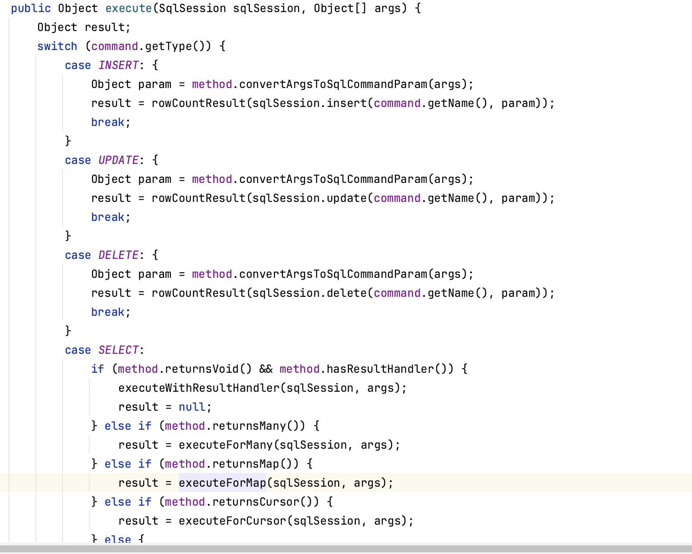

4. **检查一级缓存**：`Executor` 首先生成独一无二的key，然后去查询自身维护的一级缓存（一个 `Map`），如果同样的查询已经执行过，直接返回结果。
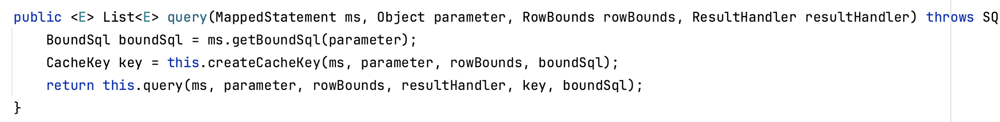


5. **获取数据库连接**：若缓存未命中，则从数据源获取一个 `Connection`。

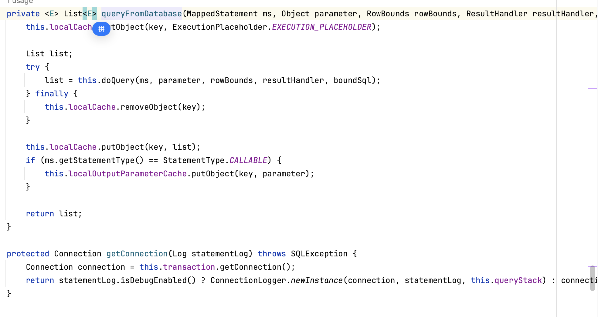
6. **创建处理器**：它会创建一个 `StatementHandler`，由它来与 JDBC 直接对话。
7. **参数设置**：`StatementHandler` 会调用 `ParameterHandler`，由后者负责将我们的 Java 参数（`id=1`）安全地设置到 `PreparedStatement` 的 `?` 占位符上。
8. **执行SQL**：`StatementHandler` 调用 JDBC 的 `execute()` 方法，将 SQL 发送给数据库。


#### 第四幕：化茧成蝶 - `ResultSet` 的结果映射

数据库返回了一个 `ResultSet` 结果集，这是原始的、丑陋的数据。MyBatis 需要将它变为我们喜爱的、优雅的 Java 对象。

1. **`ResultSetHandler` 登场**：`StatementHandler` 将 `ResultSet` 交给结果集处理器 `ResultSetHandler`。
2. **反射大法**：`ResultSetHandler` 根据 `MappedStatement` 中定义的返回类型（`resultType` 或 `resultMap`），利用 **Java 反射** 创建出 `User` 类的实例。
3. **逐一赋值**：它遍历 `ResultSet` 的每一行，根据列名和 `User` 对象的属性名进行匹配，并将值赋给对象的相应字段。
4. **类型转换**：在赋值过程中，如果遇到数据库类型（如 `TIMESTAMP`）和 Java 类型（如 `java.util.Date`）不匹配的情况，会调用相应的 `TypeHandler` 进行转换。
5. **返回对象**：最终，一个或多个填充完毕的 `User` 对象被返回，并在此之前被存入一级缓存。

至此，从一次方法调用到得到一个Java对象的奇妙旅程全部完成。

### 神来之笔：插件机制 (Interceptor)

如果说以上流程是 MyBatis 的主干，那么插件机制就是它伸向四面八方的灵活触手。MyBatis 允许我们通过**插件（Interceptor）**，在四大核心组件（`Executor`, `StatementHandler`, `ParameterHandler`, `ResultSetHandler`）的关键方法执行前后，插入我们自己的逻辑。

其原理同样是**动态代理**。MyBatis 会为被拦截的组件创建层层代理，形成一个**责任链**。这使得诸如**通用分页 (`PageHelper`)**、**性能监控**、**数据加解密**等功能可以“无侵入”地集成到框架中，极大地增强了其扩展性。

### 结语

揭开 MyBatis 的底层面纱，我们看到的不是什么魔法，而是一幅由**工厂、建造者、代理、模板方法**等经典设计模式精心编织而成的优雅画卷。它通过**命名约定**将接口与SQL绑定，通过**动态代理**解耦调用与执行，通过**反射**实现了数据与对象的自动映射。

理解了这些原理，MyBatis 对我们而言，将不再是一个“黑盒”，而是一个值得信赖、可被掌控的强大工具。下一次，当你在调试一个棘手的数据库问题时，或许就能胸有成竹地 `Step Into`，深入源码，直抵问题的核心。
