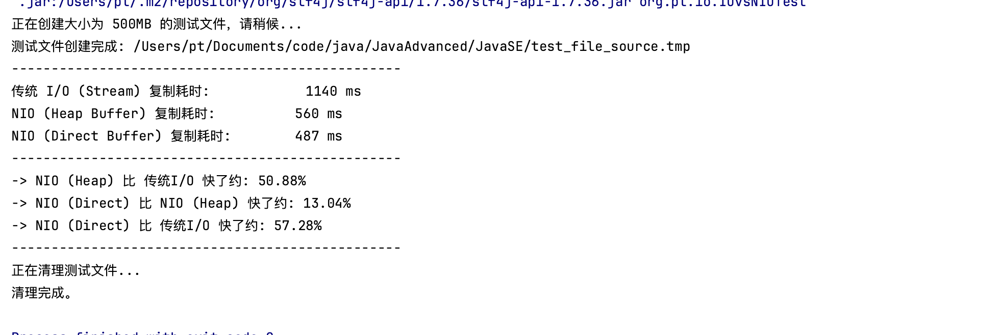

提到Java I/O，相信你一定不陌生。你可能使用I/O操作读写文件，也可能使用它实现Socket的信息传输…这些都是我们在系统中最常遇到的和I/O有关的操作。

我们都知道，I/O的速度要比内存速度慢，尤其是在现在这个大数据时代背景下，I/O的性能问题更是尤为突出，I/O读写已经成为很多应用场景下的系统性能瓶颈，不容我们忽视

## 什么是I/O？

I/O是机器获取和交换信息的主要渠道，而流是完成I/O操作的主要方式。在计算机中，流是一种信息的转换。流是有序的，因此相对于某一机器或者应用程序而言，我们通常把机器或者应用程序接收外界的信息称为输入流（InputStream），从机器或者应用程序向外输出的信息称为输出流（OutputStream），合称为输入/输出流（I/O Streams）。

机器间或程序间在进行信息交换或者数据交换时，总是先将对象或数据转换为某种形式的流，再通过流的传输，到达指定机器或程序后，再将流转换为对象数据。因此，流就可以被看作是一种数据的载体，通过它可以实现数据交换和传输。

Java的I/O操作类在包java.io下，其中InputStream、OutputStream以及Reader、Writer类是I/O包中的4个基本类

## 传统I/O的性能问题

I/O操作分为磁盘I/O操作和网络I/O操作。前者是从磁盘中读取数据源输入到内存中，之后将读取的信息持久化输出在物理磁盘上；后者是从网络中读取信息输入到内存，最终将信息输出到网络中。但不管是磁盘I/O还是网络I/O，在传统I/O中都存在严重的性能问题

### 1.多次内存复制

在传统I/O中，我们可以通过InputStream从源数据中读取数据流输入到缓冲区里，通过OutputStream将数据输出到外部设备（包括磁盘、网络）。具体流程如下：

- JVM会发出read()系统调用，并通过read系统调用向内核发起读请求；
- 内核向硬件发送读指令，并等待读就绪；
- 内核把将要读取的数据复制到指向的内核缓存中；
- 操作系统内核将数据复制到用户空间缓冲区，然后read系统调用返回。

在这个过程中，数据先从**外部设备**复制到**内核空间**，再从**内核空间**复制到**用户空间**，这就发生了两次内存复制操作。这种操作会导致不必要的数据拷贝和上下文切换，从而降低I/O的性能

### 2.阻塞

在传统I/O中，InputStream的read()是一个while循环操作，它会一直等待数据读取，直到数据就绪才会返回。**这就意味着如果没有数据就绪，这个读取操作将会一直被挂起，用户线程将会处于阻塞状态。**

在少量连接请求的情况下，使用这种方式没有问题，响应速度也很高。但在发生大量连接请求时，就需要创建大量监听线程，这时如果线程没有数据就绪就会被挂起，然后进入阻塞状态。一旦发生线程阻塞，这些线程将会不断地抢夺CPU资源，从而导致大量的CPU上下文切换，增加系统的性能开销

## 如何优化I/O操作

面对以上两个性能问题，不仅编程语言对此做了优化，各个操作系统也进一步优化了I/O。JDK1.4发布了java.nio包（new I/O的缩写），NIO的发布优化了内存复制以及阻塞导致的严重性能问题。JDK1.7又发布了NIO2，提出了从操作系统层面实现的异步I/O。下面我们就来了解下具体的优化实现

### 1.使用缓冲区优化读写流操作

在传统I/O中，提供了基于流的I/O实现，即InputStream和OutputStream，这种基于流的实现以字节为单位处理数据。NIO与传统 I/O 不同，它是基于块（Block）的，它以块为基本单位处理数据。在NIO中，最为重要的两个组件是缓冲区（Buffer）和通道（Channel）。Buffer是一块连续的内存块，是 NIO 读写数据的中转地。Channel表示缓冲数据的源头或者目的地，它用于读取缓冲或者写入数据，是访问缓冲的接口。传统I/O和NIO的最大区别就是传统I/O是面向流，NIO是面向Buffer。Buffer可以将文件一次性读入内存再做后续处理，而传统的方式是边读文件边处理数据。虽然传统I/O后面也使用了缓冲块，例如BufferedInputStream，但仍然不能和NIO相媲美。使用NIO替代传统I/O操作，可以提升系统的整体性能，效果立竿见影

### 2. 使用DirectBuffer减少内存复制

NIO的Buffer除了做了缓冲块优化之外，还提供了一个可以直接访问物理内存的类DirectBuffer。普通的Buffer分配的是JVM堆内存，而DirectBuffer是直接分配物理内存(非堆内存)。我们知道数据要输出到外部设备，必须先从用户空间复制到内核空间，再复制到输出设备，而在Java中，在用户空间中又存在一个拷贝，那就是从Java堆内存中拷贝到临时的直接内存中，通过临时的直接内存拷贝到内存空间中去。此时的直接内存和堆内存都是属于用户空间。

你肯定会在想，为什么Java需要通过一个临时的非堆内存来复制数据呢？如果单纯使用Java堆内存进行数据拷贝，当拷贝的数据量比较大的情况下，Java堆的GC压力会比较大，而使用非堆内存可以减低GC的压力。DirectBuffer则是直接将步骤简化为数据直接保存到非堆内存，从而减少了一次数据拷贝。以下是JDK源码中IOUtil.java类中的write方法：

```java
        if (src instanceof DirectBuffer)
            return writeFromNativeBuffer(fd, src, position, nd);

        // Substitute a native buffer
        int pos = src.position();
        int lim = src.limit();
        assert (pos <= lim);
        int rem = (pos <= lim ? lim - pos : 0); 
        ByteBuffer bb = Util.getTemporaryDirectBuffer(rem);
        try {
            bb.put(src);
            bb.flip();
        // ...............
```

这里拓展一点，由于DirectBuffer申请的是非JVM的物理内存，所以创建和销毁的代价很高。DirectBuffer申请的内存并不是直接由JVM负责垃圾回收，但在DirectBuffer包装类被回收时，会通过Java Reference（强引用，软引用，弱引用，虚引用）机制来释放该内存块。DirectBuffer只优化了用户空间内部的拷贝，而之前我们是说优化用户空间和内核空间的拷贝，那Java的NIO中是否能做到减少用户空间和内核空间的拷贝优化呢？答案是可以的，DirectBuffer是通过unsafe.allocateMemory(size)方法分配内存，也就是基于本地类Unsafe类调用native方法进行内存分配的。而在NIO中，还存在另外一个Buffer类：MappedByteBuffer，跟DirectBuffer不同的是，MappedByteBuffer是通过本地类调用mmap进行文件内存映射的，map()系统调用方法会直接将文件从硬盘拷贝到用户空间，只进行一次数据拷贝，从而减少了传统的read()方法从硬盘拷贝到内核空间这一步。

## 测试案例

#### 传统io

```java
package org.pt.io;

import java.io.*;

/**
 * @ClassName TraditionalIOFileCopier
 * @Author pt
 * @Description
 * @Date 2025/6/13 20:12
 **/
public class TraditionalIOFileCopier {
    /**
     * 使用传统的带缓冲的流来复制文件。
     *
     * @param source 源文件路径
     * @param dest   目标文件路径
     * @throws IOException IO异常
     */
    protected void copyFile(File source, File dest) throws IOException {
        // 使用try-with-resources确保流能被自动关闭
        try (InputStream in = new BufferedInputStream(new FileInputStream(source));
             OutputStream out = new BufferedOutputStream(new FileOutputStream(dest))) {
            byte[] buffer = new byte[8192]; // 8KB的缓冲区
            int bytesRead;
            // 循环从输入流读取数据到缓冲区，再从缓冲区写入到输出流
            while ((bytesRead = in.read(buffer)) != -1) {
                out.write(buffer, 0, bytesRead);
            }
        }
    }
}

```

#### 基于堆缓冲区的nio

```java
package org.pt.io;

import java.io.File;
import java.io.FileInputStream;
import java.io.FileOutputStream;
import java.io.IOException;
import java.nio.ByteBuffer;
import java.nio.channels.FileChannel;

/**
 * @ClassName NIOHeapBufferFileCopier
 * @Author pt
 * @Description
 * @Date 2025/6/13 20:18
 **/
public class NIOHeapBufferFileCopier {
    /**
     * 使用NIO的Channel和基于JVM堆的HeapBuffer来复制文件。
     *
     * @param source 源文件路径
     * @param dest   目标文件路径
     * @throws IOException IO异常
     */
    public void copyFile(File source, File dest) throws IOException {
        try (FileChannel sourceChannel = new FileInputStream(source).getChannel();
             FileChannel destChannel = new FileOutputStream(dest).getChannel()) {
            // 创建一个基于JVM堆内存的缓冲区（HeapBuffer）这是与DirectBuffer的关键区别
            ByteBuffer buffer = ByteBuffer.allocate(8192); // 8KB的堆缓冲区
            while (sourceChannel.read(buffer) != -1) {
                // 切换缓冲区为读模式
                buffer.flip();
                // 确保缓冲区的数据全部写入目标通道
                while (buffer.hasRemaining()) {
                    destChannel.write(buffer);
                }
                // 清空缓冲区，为下一次读取做准备
                buffer.clear();
            }
        }
    }
}
```

#### 基于本地内存缓冲区的nio

```java
package org.pt.io;

import java.io.File;
import java.io.FileInputStream;
import java.io.FileOutputStream;
import java.io.IOException;
import java.nio.ByteBuffer;
import java.nio.channels.FileChannel;

/**
 * @ClassName NIOOutHeapBufferFileCopier
 * @Author pt
 * @Description
 * @Date 2025/6/13 20:23
 **/
public class NIOOutHeapBufferFileCopier {
    /**
     * 使用NIO的Channel和基于JVM堆外的HeapBuffer来复制文件。
     *
     * @param source 源文件路径
     * @param dest   目标文件路径
     * @throws IOException IO异常
     */
    public void copyFile(File source, File dest) throws IOException {
        try (FileChannel sourceChannel = new FileInputStream(source).getChannel();
             FileChannel destChannel = new FileOutputStream(dest).getChannel()) {
            // 创建一个基于本地内存的缓冲区
            ByteBuffer buffer =  ByteBuffer.allocateDirect(8192);; // 8KB的堆缓冲区
            while (sourceChannel.read(buffer) != -1) {
                // 切换缓冲区为读模式
                buffer.flip();
                // 确保缓冲区的数据全部写入目标通道
                while (buffer.hasRemaining()) {
                    destChannel.write(buffer);
                }
                // 清空缓冲区，为下一次读取做准备
                buffer.clear();
            }
        }
    }
}

```

#### 测试方法

```java
package org.pt.io;

/**
 * @ClassName IOvsNIOTest
 * @Author pt
 * @Description
 * @Date 2025/6/13 20:20
 **/

import java.io.File;
import java.io.FileOutputStream;
import java.io.IOException;
import java.util.Random;

public class IOvsNIOTest {

    private static final String FILE_NAME_PREFIX = "test_file_";
    private static final int FILE_SIZE_MB = 500; // 定义测试文件大小（MB）

    public static void main(String[] args) {
        //  准备测试文件
        File sourceFile = null;
        File traditionalDestFile = new File(FILE_NAME_PREFIX + "traditional_copy.tmp");
        File nioDestFile = new File(FILE_NAME_PREFIX + "nio_heap_copy.tmp");
        File nioDirectDestFile = new File("copy_nio_direct.tmp");
        try {
            System.out.println("正在创建大小为 " + FILE_SIZE_MB + "MB 的测试文件，请稍候...");
            sourceFile = createLargeTestFile(FILE_NAME_PREFIX + "source.tmp", FILE_SIZE_MB);
            System.out.println("测试文件创建完成: " + sourceFile.getAbsolutePath());
            System.out.println("-------------------------------------------------");
            // 测试传统 I/O
            TraditionalIOFileCopier traditionalCopier = new TraditionalIOFileCopier();
            long startTimeTraditional = System.nanoTime();
            traditionalCopier.copyFile(sourceFile, traditionalDestFile);
            long endTimeTraditional = System.nanoTime();
            long traditionalDuration = (endTimeTraditional - startTimeTraditional) / 1_000_000;
            System.out.printf("传统 I/O (Stream) 复制耗时:            %d ms%n", traditionalDuration);
            // 测试 NIO (Heap Buffer)
            NIOHeapBufferFileCopier nioHeapCopier = new NIOHeapBufferFileCopier();
            long startTimeNIOHeap = System.nanoTime();
            nioHeapCopier.copyFile(sourceFile, nioDestFile);
            long endTimeNIOHeap = System.nanoTime();
            long nioHeapDuration = (endTimeNIOHeap - startTimeNIOHeap) / 1_000_000;
            System.out.printf("NIO (Heap Buffer) 复制耗时:          %d ms%n", nioHeapDuration);

            // 测试 NIO (Direct Buffer / 本地内存)
            NIOOutHeapBufferFileCopier nioDirectCopier = new NIOOutHeapBufferFileCopier();
            long startTimeNIODirect = System.nanoTime();
            nioDirectCopier.copyFile(sourceFile, nioDirectDestFile);
            long endTimeNIODirect = System.nanoTime();
            long nioDirectDuration = (endTimeNIODirect - startTimeNIODirect) / 1_000_000;
            System.out.printf("NIO (Direct Buffer) 复制耗时:        %d ms%n", nioDirectDuration);
            // 性能对比
            System.out.println("-------------------------------------------------");
            // 对比传统IO vs NIO(Heap)
            if (nioHeapDuration > 0 && traditionalDuration > nioHeapDuration) {
                double improvement = ((double) (traditionalDuration - nioHeapDuration) / traditionalDuration) * 100;
                System.out.printf("-> NIO (Heap) 比 传统I/O 快了约: %.2f%%%n", improvement);
            }

            // 对比NIO(Heap) vs NIO(Direct)
            if (nioDirectDuration > 0 && nioHeapDuration > nioDirectDuration) {
                double improvement = ((double) (nioHeapDuration - nioDirectDuration) / nioHeapDuration) * 100;
                System.out.printf("-> NIO (Direct) 比 NIO (Heap) 快了约: %.2f%%%n", improvement);
            }

            // 对比传统IO vs NIO(Direct)
            if (nioDirectDuration > 0 && traditionalDuration > nioDirectDuration) {
                double improvement = ((double) (traditionalDuration - nioDirectDuration) / traditionalDuration) * 100;
                System.out.printf("-> NIO (Direct) 比 传统I/O 快了约: %.2f%%%n", improvement);
            }

        } catch (IOException e) {
            System.err.println("测试过程中发生错误: " + e.getMessage());
            e.printStackTrace();
        } finally {
            // 5. 清理测试文件
            System.out.println("-------------------------------------------------");
            System.out.println("正在清理测试文件...");
            cleanup(sourceFile, traditionalDestFile, nioDestFile);
            System.out.println("清理完成。");
        }
    }

    // 创建文件
    private static File createLargeTestFile(String fileName, int sizeInMB) throws IOException {
        File file = new File(fileName);
        file.deleteOnExit();
        byte[] junk = new byte[1024 * 1024];
        new Random().nextBytes(junk);

        try (FileOutputStream out = new FileOutputStream(file)) {
            for (int i = 0; i < sizeInMB; i++) {
                out.write(junk);
            }
        }
        return file;
    }

    private static void cleanup(File... files) {
        for (File file : files) {
            if (file != null && file.exists()) {
                if (!file.delete()) {
                    System.err.println("警告: 未能删除文件 " + file.getAbsolutePath());
                }
            }
        }
    }
}
```

### 结果对比


